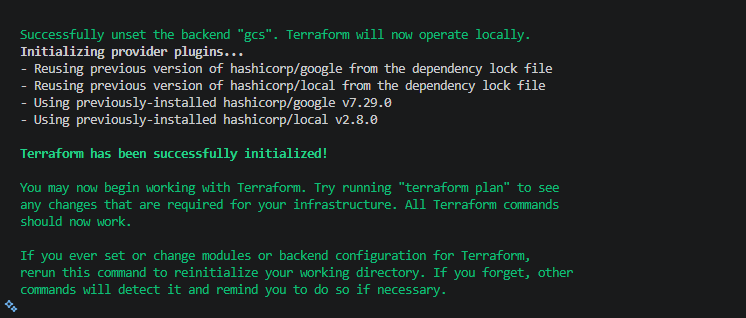
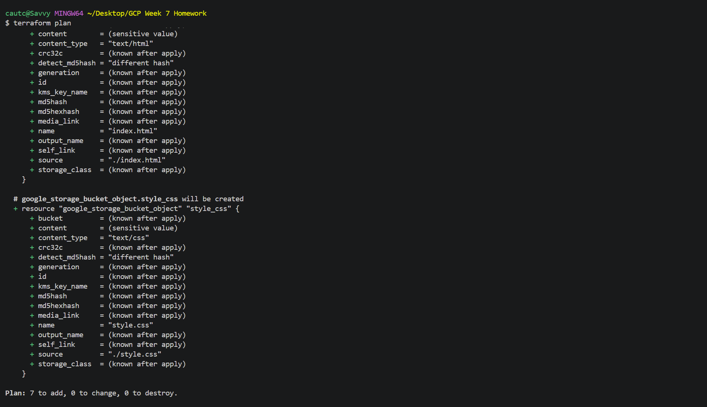
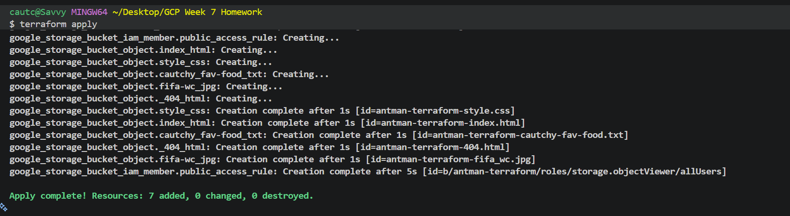
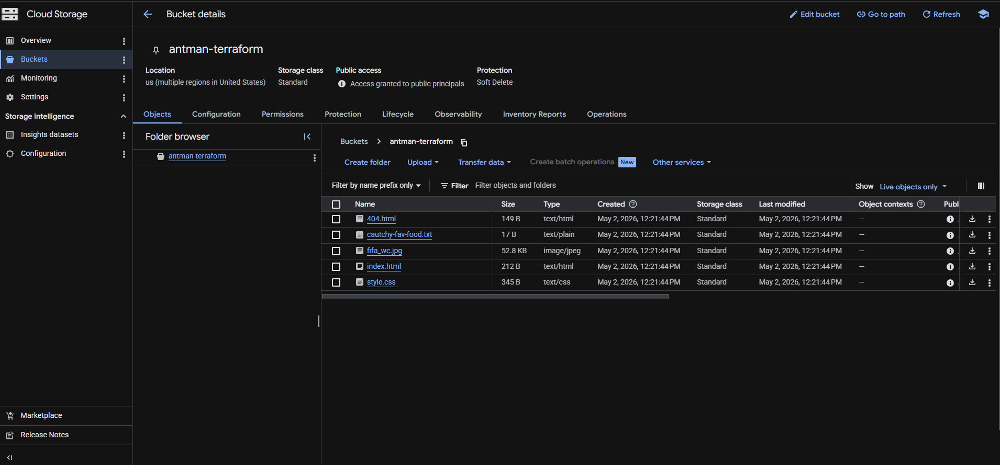
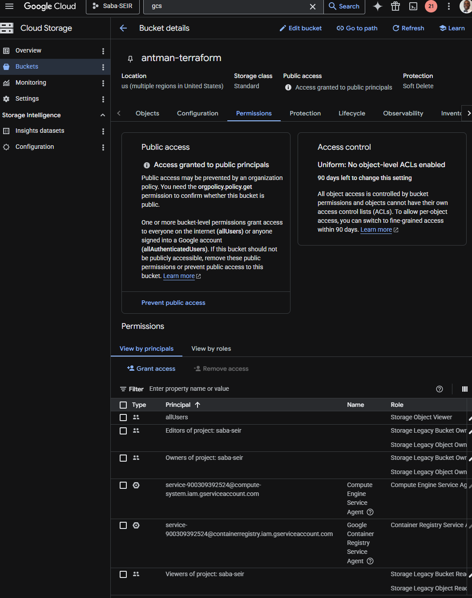
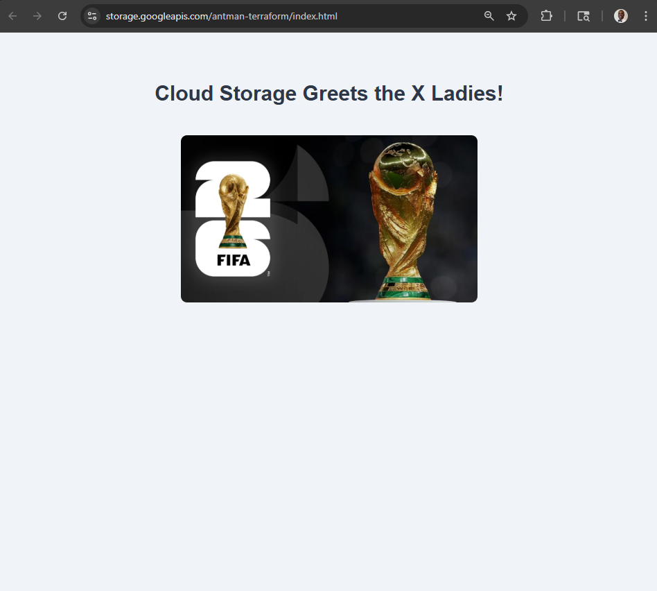
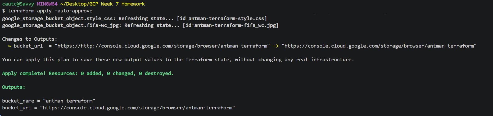

# GCS Static Website Hosting with Terraform


---

## 1. Title — What Is This Lab Supposed to Do?

The goal for this lab is to deploy a proof-of-concept (POC) static website that is entirely automated with **Google Cloud Storage (GCS) bucket** with some sample static assets provided and an image of your choosing (for the website's main page). We provision this using **Terraform**. All infrastructure — the bucket, IAM permissions, static website configuration, and object uploads — is defined and deployed entirely through code. No manual steps in the GCP Console are required after the initial project setup.

---

## 2. Lab / Task / Project Overview

The goal of this lab is to demonstrate Infrastructure as Code (IaC) principles by using Terraform to:

- Create a GCS bucket configured for static website hosting
- Apply the correct IAM policy to make bucket objects publicly accessible to anyone on the internet
- Upload static assets (HTML, CSS, and an image) as bucket objects via Terraform
- Output the public URL of the hosted site

This is a proof-of-concept (POC) that mirrors real-world patterns used to host static frontends, documentation sites, and landing pages on GCP without a web server.

---

## 3. Lab Requirements

The following tools and access are needed to complete this lab:

| Requirement   | Used?     | Notes |
|---            |---        |---|
| Terraform     | ✅ Yes    | v7.29.0+ recommended |
| Git           | ✅ Yes    | For version control and repo management |
| GCP Console   | ✅ Yes    | Used to verify bucket creation and public access |
| Google SDK (gcloud CLI)| ✅ Yes | Required for Application Default Credentials (`gcloud auth application-default login`) |

---

## 4. Project / Folder Structure

```
gcs-static-site/
├── 0-auth.tf                       # Google provider config, required_version, project variable
├── 1-backend.tf                    # Terraform backend configuration (not needed but good practice)
├── 2-main.tf                       # Core infrastructure: bucket, IAM, object uploads
├── 3-outputs.tf                    # Website URL output
├── index.html                      # Main landing page (provided by instructor)
├── 404.html                        # Error/not-found page (provided by instructor)
├── style.css                       # Stylesheet (provided by instructor)
├── fifa_wc.jpg                     # FIFA WC Image (or your image of choice)
├── README.md                       # Readme file
└── cautch-fav-food.txt             # File generated by Terraform during the process
   ├── artifacts
    
```
---

## 5. Steps Used to Complete This Lab

### Step 1 — Environment setup

```bash
# Navigate to your working directory (must NOT be inside an existing git repo)
cd ~/projects

# Open VS Code
code .

# Confirm working directory
pwd

# Download provided assets
curl https://raw.githubusercontent.com/aaron-dm-mcdonald/class7.5-notes/refs/heads/main/week-7/bam/download-assets.sh | sh
```

### Step 2 — Inspect the HTML and add your image

Open `index.html` and find the `` tag to identify the expected image filename. Add your chosen image to the project folder and make sure that it has that exact filename (fifa_wc.jpg for this lab).

### Step 3 — Write `provider.tf`

see [FILENAME]: 0-auth.tf
- run through Terraform IvPAD (terraform init)

### Step 4 — Write `backend.tf`

see [FILENAME]: 1-backend.tf
- run through Terraform IvPAD (terraform init)

### Step 5 — Write `main.tf`

see [FILENAME]: 2-main.tf
- run through Terraform PAD after every block added just to be safe (terraform plan...)

### Step 6 — Write `outputs.tf`

see [FILENAME]: 3-outputs.tf
- run through Terraform PAD after every block added just to be safe (terraform plan...)

### Step 7 — Verify public access

Open the output URL in your browser. Share it with a friend to confirm they can access it from their machine without any authentication.
Then in your console:

# Test public access from the command line
curl -I https://storage.googleapis.com/antman-terraform/index.html #Your site URL
# Expected: HTTP/2 200
---

## 6. Artifacts / Screenshots

> - `terraform init` output showing provider download


> - `terraform plan` showing resources to be created


> - `terraform apply` showing successful creation of all resources


> - GCP Console → Cloud Storage showing the bucket and uploaded objects


> - GCP Console → Permissions tab showing `allUsers` with `Storage Object Viewer`


> - The live static website loaded in a browser


> - `terraform output` showing the website URL

---

## 7. Teardown / Destroy

To remove all infrastructure provisioned by this lab:

```bash
# Preview what will be destroyed
terraform plan -destroy

# Destroy all resources
terraform destroy
```

> `force_destroy = true` is set on the bucket, which allows Terraform to delete the bucket even when it still contains objects. Without this flag, `terraform destroy` would fail if any objects exist in the bucket.

After destroy, verify in the GCP Console that the bucket no longer exists.

---

## 8. Lessons Learned

### Is Terraform a good tool to provision buckets?

Yes — Terraform is an excellent tool for provisioning GCS buckets. The declarative nature of it makes learning what is needed required and what is optional that much easier to find out when building. And of course this means the build can be replicated consistently across different environments and projects.

### Is Terraform an ideal tool to upload objects into buckets? Why or why not?

For a POC or small number of static files, then yes it works fine. However, for production or large numbers of files it is not ideal. Thinking of Terraform as an infrastructure builder, why would you ask the builders of your new house to also be your movers? Things may get lost or take much longer than previously thought; it would make the state file too large and untidy for continuous build improvements with Terraform as well (and slow down tf plan and tf apply as a result of it).

### Explain how you wrote the output

I needed the output to have the site URL and in order to code it properly I had to go to the site to see what the URL nomenclature is like. From there (and poaying attention to where it placed my bucket name etc), I was able to figure out where I needed to place the name attribute of the bucket using interpolation. Since the site itself is at 'index.html', I made sure to append that to the link i.e. https://storage.googleapis.com/${google_storage_bucket.antman_terraform.name}/index.html

### Did you need uniform bucket-level access? Do you know what it does?

It was required by the GCP organization policy (`constraints/storage.uniformBucketLevelAccess`), which caused a 412 error on the first apply attempt. Setting `uniform_bucket_level_access = true` forced all access control to go through IAM. Since my IAM block had a public access rule set for 'allUsers', the bucket was made public. ACLs can't override IAM policies this way.

### Explain the IAM resource — why is it needed, was it hard to implement, did the hints help?

Without the IAM resource, the bucket exists but all objects return 403 Forbidden to the public. Since my IAM block had a public access rule set for 'allUsers', the bucket was made public. ACLs can't override IAM policies this way. The hints were helpful in clarifying that `allUsers` (not `public` or `everyone`) is the correct member string, and that `iam_member` is the preferred resource over `iam_binding` or `iam_policy` because it is non-destructive to other existing IAM bindings.

### What setting enables static website hosting?

The `website {}` block inside the `google_storage_bucket` resource. 
- `main_page_suffix = "index.html"` — serves this file when the bucket root is requested
- `not_found_page = "404.html"` — serves this file when an object is not found

### What changes could improve this infrastructure?

- A load balancer in front of this would be nice
- Use a **`for_each`** loop over a map of objects instead of one resource block per file
- A **lifecycle rule** to the bucket for automated cleanup of old object versions

---

## 9. References

### GCP / Terraform Documentation

- Google Cloud. (n.d.). *Hosting a static website*. Google Cloud Storage Documentation. https://docs.cloud.google.com/storage/docs/hosting-static-website
- Google Cloud. (n.d.). *Create buckets and upload objects with Terraform*. Google Cloud Storage Documentation. https://docs.cloud.google.com/storage/docs/terraform-create-bucket-upload-object
- Google Cloud. (n.d.). *Uniform bucket-level access*. Google Cloud Storage Documentation. https://docs.cloud.google.com/storage/docs/uniform-bucket-level-access

### Course / Lab Materials

- GitHub. https://github.com/aaron-dm-mcdonald/class7.5-notes/tree/main/week-7/bam

---

## 10. Troubleshooting

### Error 412 — Bucket name with underscore

**Symptom:** `googleapi: Error 412` on `terraform apply` when creating the bucket.

**Cause:** GCS bucket names must follow DNS naming conventions. Underscores are not allowed.

**Fix:** Changed `name = "antman_terraform"` to `name = "antman-terraform"` (hyphen instead of underscore).

```bash
# After fixing the name, re-run:
terraform apply
```

---

### Error 412 — `constraints/storage.uniformBucketLevelAccess`

**Symptom:**
```
Error: googleapi: Error 412: Request violates constraint
'constraints/storage.uniformBucketLevelAccess', conditionNotMet
```

**Cause:** The GCP organization has an enforced policy requiring all buckets to use uniform bucket-level access. The bucket resource did not include this setting.

**Fix:** Added `uniform_bucket_level_access = true` to the bucket resource block.

```bash
terraform apply
```

---

### General troubleshooting commands used

```bash
# Check current Terraform infrastructure deployed at each step of building the Terraform
terraform state list

# Validate configuration syntax without applying
terraform validate

# See planned changes
terraform plan

# Check GCP auth is working and that you are in the correct project
gcloud config list

# Test public access from the command line
curl -I https://storage.googleapis.com/antman-terraform/index.html
# Expected: HTTP/2 200
```

---

## 11. Author & Contributors

| Name | Role |
|---|---|
| Cautchy Bailly | Author |
| Jacques Payne | Group Leader |

**Group:** Tetsuzai Kubo Ouroboros

**Version:** 1.0.0
**Date:** May 1, 2026

---

*This lab was completed as part of coursework under group leader Jacques Payne, Tetsuzai Kubo Ouroboros cohort.*