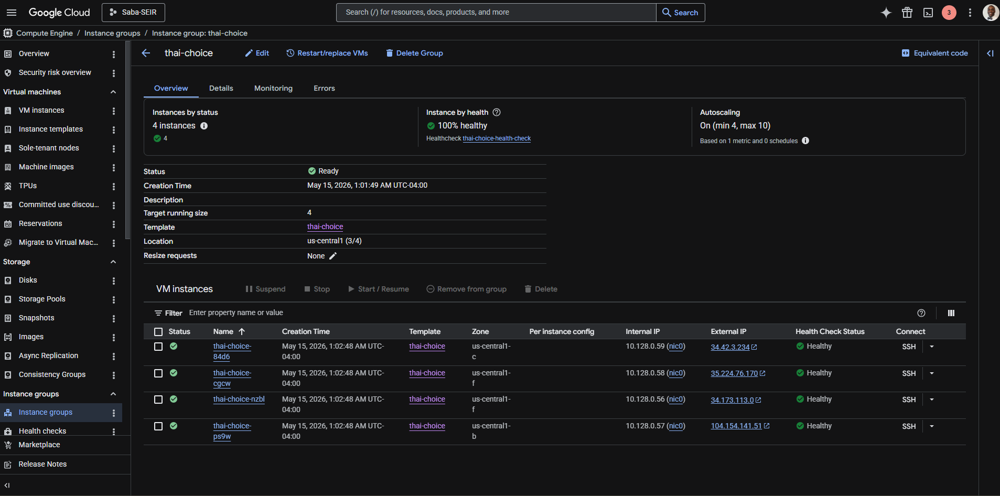

# Week 8 GCP Homework + BAM

## Q&A (each answer between 1 and 5 sentences)
- **LOAD BALANCERS**
    - **How does load balancing contribute to Fault tolerance? What about high availability?**
Load balancing allows you to have instances in different zones ensuring that, if one zone has issues, the health check fails and another one is spun up and the user is automatically directed to another instance to continue working (No downtime herego fault tolerance). In terms of high availability, if the system is having no downtime due to the load balancer's work, then it is a highly available system (1-0.99999 uptime is till met).

    - **Do global load balancers decrease latency for end users? Why or why not? **
Global load balancers decrease latency for end users due to the fact that without them the traffic flows directly from the user's network to the virtual machine instance. With load balancing, the traffic will flow to the closest edge point of presence (edge POP - Google Front Ends or GFEs in this case) depending on the tier (premium tier gets you closer to the user's location and standard tier gets you closer to the destination region). External ALBs have a 123 ms TTFB compared to the standard 230 ms.

    - **What are LB health checks for? Do we always need them? Is a LB different from a reverse proxy? **
Load balancer health checks are to make sure that the MIG does not have any unhealthy instances currently user facing. Should there be any, the health check will alert that they are there and this triggers the autohealing resulting in all healthy instances being customer facing with no downtime. You always need them in production environments (high availability, no downtime). A LB balances inbound requests across 2+ web servers thereby balancing the load. A reverse proxy can do that but also manages the server (caching, security, SSL acceleration). Basically, pro max kine things.

    - **What are LB routing rules and URL maps for? Give an example or two of them in use. **
URL maps act as the central routing configuration (Google Maps if you will) directing traffic to specific backends based on hostnames and URL paths **(path-based)**. LB routing rules are **criteria-based** instructions to determine how traffic is sent to the backend targets (based on priority given by processing in numerical order). URL maps can send all traffic such as /node to a different service than /python for example. Routing rules can distribute traffic based on weights (20% goes to resource A, 15% to resource B, etc...)

    - **Explain what an anycast IP address is used for in the context of a global load balancer. **
Anycast IP will give a single IP address that multiple servers can use. With this, only one global load balancer is needed to work with multiple different locations

- **CLOUD ARMOR**
    - What does cloud armor offer? 
    - Why is it used in the first place?
    - What layer in the OSI model does it operate at? Why is this important and how is this firewall different from VPC firewall rules? 
    - What are rate based rules for? 
    - What is reCAPTCHA and how does it relate to this service? 

- **CLOUD CDN**
    - What are POPs used for? 
    - What kind of files are served with Cloud CDN? 
    - What services can be used with cloud CDN for the source of content (the origin)? 
    - Does Cloud CDN help protect against any types of malicious actors or cyberattacks? Explain. 
    - Should an enterprise always use cloud CDN? Why or why not? 
    - What is TTL and how does it control content “freshness”? 

## Runbook

### Goal (3 sentences max)
- To create a fully configured external application load balancer via ClickOps backed by MIG

### Prerequisites (what do I need to have ready to make this happen?)
- Google Account
- Global Instance Template 
- Locust

## Achieving the goal in ClickOps
- Log into your console.cloud.google.com 
- Click on the site menu button (three horizontal lines on top of each other)
- Go to Compute Engine > Instance templates
- If you have your template already created, GREAT. If not click on "Create instance template" at the top of the page. We will create two instance templates

### Creating the instance template
- Instance template 1 details (all options not mentioned stay at default):
    - Name : thai-choice
    - Location : Global
    - Firewall : Allow HTTP traffic, Allow Load Balancer Health Checks
    - Advanced options
        - Networking : make sure that you see the network tags "http-server" and "lb-health-check"
        - Management > Automation
            - Insert the following script
                - [Thailand](thailand.sh)
    - Click "Create" for thai-choice

### Creating the MIG (again any resource not explicitly mentioned stays default)
- Select the instance template created (top-of-the-class), then click the 3 vertical dots under 'Actions' and select "Create Instance Group"
- Make sure to select "New managed instance group (stateless)"
    - Name : thai-choice
    - Instance template : thai-choice (or whatever your instance template may be)
    - Autoscaling > Configure autoscaling
        - Minimum number of instances : 4
        - Maximum number of instances : 10
    - VM instance lifecycle
        - Autohealing > Health check > Create a health check
            - Name : thai-choice-health-check
            - Scope : Global
            - Logs : On
            - Health criteria
                - Check interval : 10 seconds
                - Timeout : 5 seconds
                - Healthy threshold : 2 consecutive successes
                - Unhealthy threshold : 2 consecutive failures
                - SAVE

Once done, pray that it works and allow five minutes for everything to show green checks

### Creating the Global Load Balancer
- Type "load balancing" in the search bar, then click on the "Load balancing" resource page
- Click "Create load balancer" at the top of the page
    - Type of load balancer : Application Load Balancer
    - Public facing
    - Global
    - Global external Application Load Balancer
    - Click Configure
    - Name : thai-choice-alb
        - Frontend configuration
            - Name : thai-choice-frontend
        - Backend configuration
            - Create a backend service
                - Name : thai-choice-backend
                - Backend type : instance group
                - Health check : thai-choice-health-check
                - Instance group : thai-choice
                - Port number : 80
                - Balancing mode : rate
                - Maximum RPS : you decide
                - As always, anything not explicitly mentioned can stay default
                - Click Create
        - Review and finalize
        - Create

Repeat this process for another MIG (created wwith either the same template or another - basic-colombia template in our case)
- Repeat the process for a

## Terraform

- Before starting the process, run 'gcloud config list' in the terminal and confirm that the project and your account is well configured

- Mandatory Requirements for a fully configured external application load balancer via Terraform

- How to ...

RESOURCES USED: 
- https://docs.cloud.google.com/nat/docs/private-nat
- https://datatracker.ietf.org/doc/html/rfc5128
- https://docs.cloud.google.com/compute/docs/instance-groups/autohealing-instances-in-migs?_gl=1*12xkdi9*_ga*MTM1NzM1ODU0NC4xNzczMjc2MDYw*_ga_WH2QY8WWF5*czE3Nzg4MDU5MjgkbzczJGcxJHQxNzc4ODE0MzU1JGo1NSRsMCRoMA..#example_health_check_set_up
- https://medium.com/towards-data-engineering/mastering-load-testing-with-locust-on-a-gcp-vm-a-step-by-step-guide-14869de1be5
- https://docs.cloud.google.com/load-balancing/docs/tutorials/optimize-app-latency
- https://docs.cloud.google.com/load-balancing/docs/https
- 