## Runbook

`Goal:` Troubleshoot a VM that does not work correctly, also create a runbook so in the future this becomes easier to troubleshoot.

A anti-drunk engineer guidebook to help you un**** a VM (that you may or may not had ******up)

**Section 1 VM issue**

First check out the vm thats having the issue, look for obvious issues this one missing a `external ip address` so you can't reach the web server
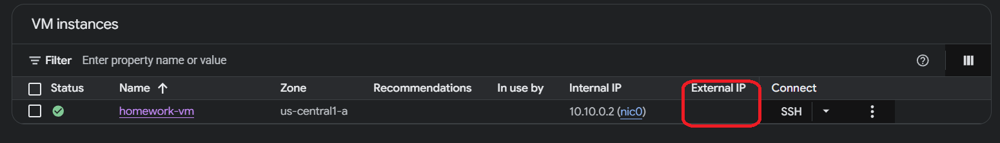
Next go inside the vm to edit things in the VM stop it from running (it was already stopped) now you can edit the information in it.

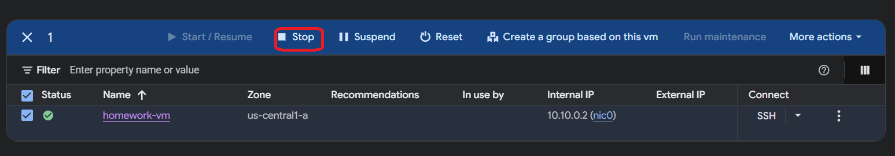

When you are inside do look for these 2 thing firewall and make sure Allow HTTP traffic is enabled and because it is missing external ip enable the ephemeral ip and save it
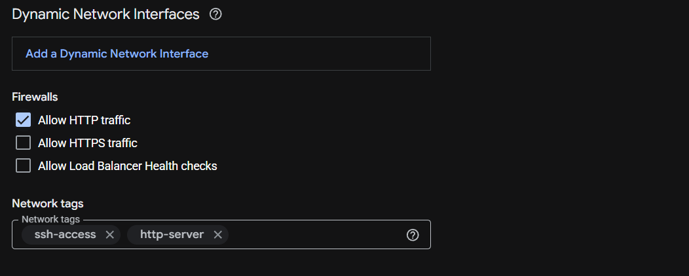

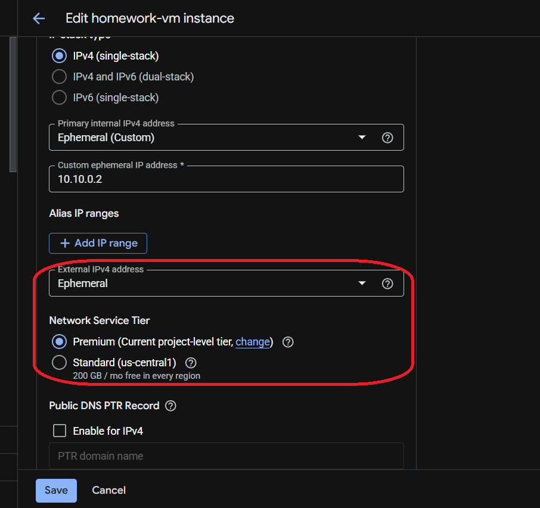

When back on the VM instance page restart the instance 

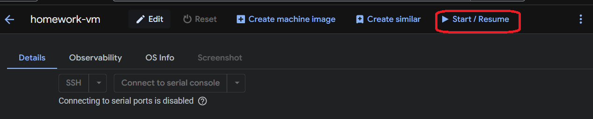

now you should see the external address in the box

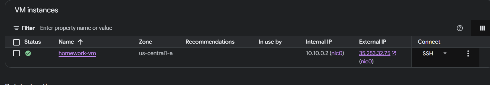

You can try it and test it and see that it still isn't reaching the web server, so we need to check more things
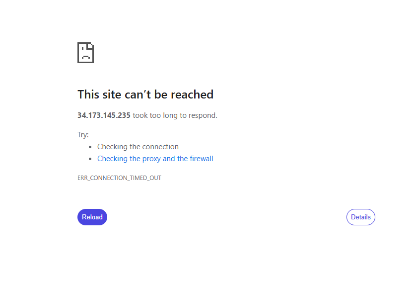

**Section 2 Firewall Issues**

Now check the vpc and find the vpc connected to the VM with the issues click on it and go into it.

Check the subnet and firewall rules, when going into the firewall make sure to delete the `homework deny-all rule`
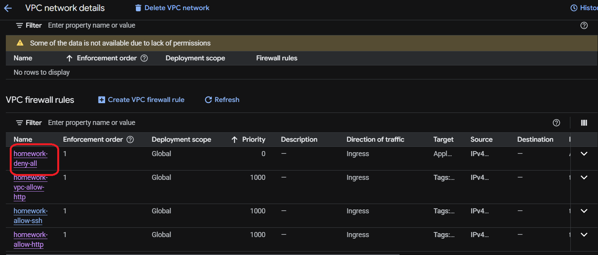 
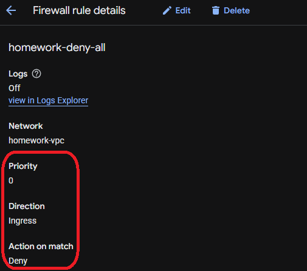
If this isn't deleted even with the other fixes you would run into the same issues.

Check on the firewall rules make sure that the target tags match for the VM and firewall rules Ex. (http-server, ssh access)

Go into the ssh and edit it make sure that it is using the correct protocol and Source IPv4 range and turn logging on as well then save it .
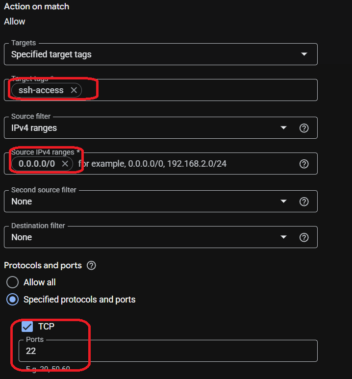
`for testing purposes changed to 0.0.0.0/0`
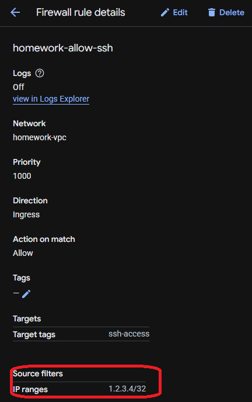

Do the same for the http rule if needed (its not) turn on logging now you should be able to ssh into the console.
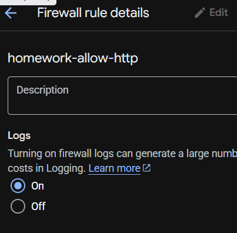

**Section 3 Routing Issue**

The last thing that needs to be done is make sure the vpc has a `default route` to the internet, if it doesn't it still not going to be able to reach its destination.

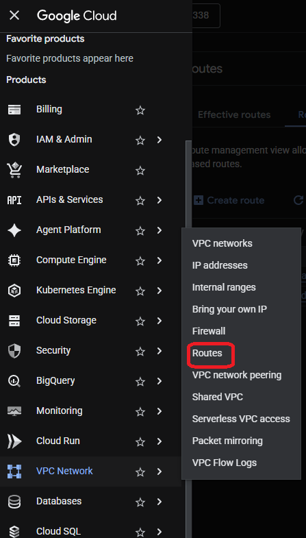

Go into Routes and Route management and create route give it a name, choose the correct vpc, and give it a destination IPv4 range and click create.
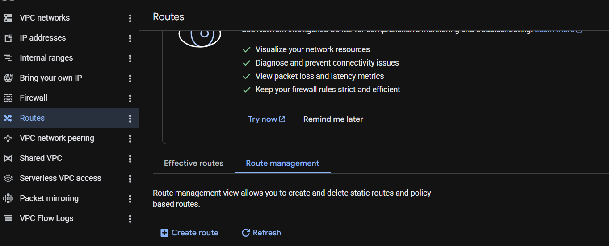
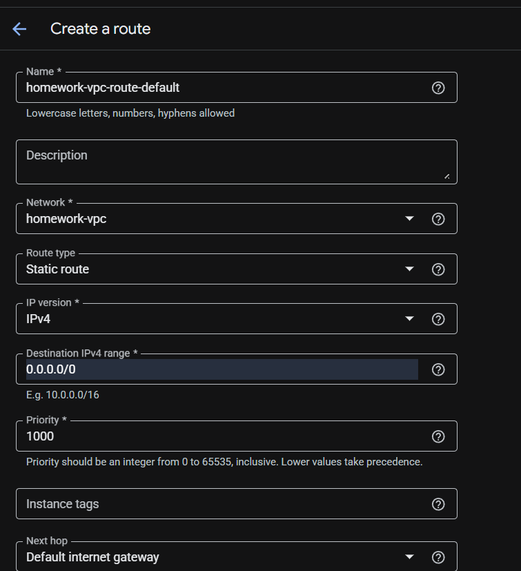
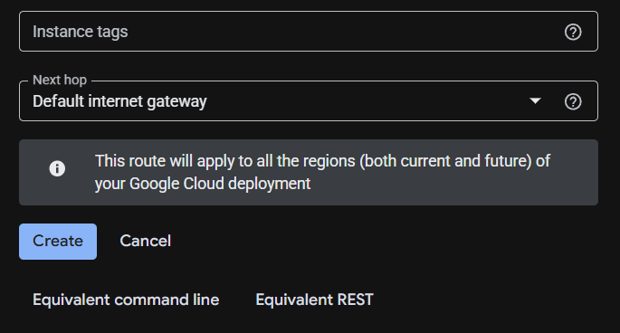

**Section 4 Return to Sober**

With all this done now try running the web server `http://external_ip_address`, you should get this:
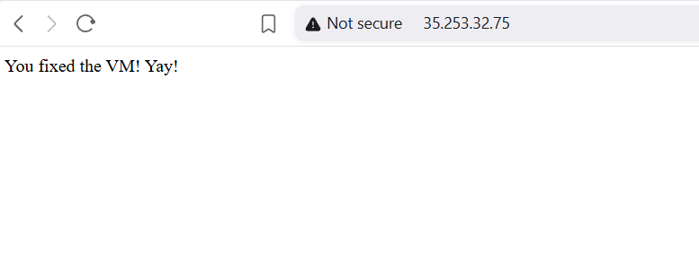

**Ticket & Summary**

Issue: VM is not accessible as web server on the public internet and ssh does not work

When I looked at the VM 2 things stood out it was stopped and it didn't have an `external ip address`, so on the surface thats the most obvious issues, so my first thoughts was to go into the VM make sure HTTP traffic is enabled (this is a common issue) and to get an external ip address for the VM, after adding those 2 piece the issue wasn't resolved so I had to do a deeper investigation

So next I looked into the VPC and for the firewall rules the first thing I noticed was a `Deny All rule` with the priority at 0, so I deleted it and also checked both the http and ssh rules first I added logging on both the http was correct, but the ssh had the wrong source ip range `(1.2.3.4/32)` so I changed that `(0.0.0.0/0)` after that I was able to ssh into the VM and ran some tests pinging, seeing if port 80 was open, and if it was actively running.  I still wasn't able to get the web server to run after that so I was missing something.

So what I lastly was create a working VM with the correct firewall rules and compared and found that the 1 that wasn't working didn't have a `Default Route` and seeing that the working one had it, I created one for for it.  I tried the browser once more and this time it was able to reach the web server, success.

I believe the root cause of the issues was the misconfigured vpc network with both the firewall rules & routes being the main issues.

`Note:` check for the clear and obvious errors first (no external ip) and most common errors (http traffic not enabled) make sure the firewall rules are configured correctly and there isn't a rule denying the access as well. Finally make sure the VPC has a default route.

`Note:` 0.0.0.0/0 is for testing/lab purposes, its a bad idea to use it in a production envirnoment unless the service is meant to be publicly accessible.

## Q&A

## DNS and SSL/TLS

**Explain what the traceroute and dig commands do. Compare and contrast.**

Traceroute maps the exact path data takes from the sender to the destination, can pinpoint bottlenecks as well, dig(Domain Information Groper) is used to query DNS servers, troubleshoot DNS issues, and verify domain records.  Both are used in the command-line and are network tools but are used differently, traceroute is used to troubleshoot network routing, dig troubleshoots DNS issues.  dig isn't native to windows

**What are the 3 or 4 most common DNS records and what are their use cases?**

`A (address Record)` resolves domain names to ip addresses (ipv4), `CNAME record(canonical name)` resolves a domain or subdomain to another domain name, `SOA record (start of authority)` stores administrative information about a dns zone, `PTR record (Pointer record)` resolves ip addresses to domain names.

**Give an overview of the steps in a TLS handshake.**

the browser ask the server to show proof of being legitmate, the server shows proof (certificate) they do a virtual handshake. Now they can trade encrypted (public keys) information.

**How does an SSL/TLS cert know what domain it belongs to?**

It goes by the SAN (Subject Alternative Name) it listsall the domain names and Ip addresses the certificate belongs to and is authorize to secure.

**What is a certificate authority?**

Its a trusted 3rd-party organization that issues digital certificates, which verify the identify of websites, devices, or individuals online.

## Load Balancers

**How do application load balancers in GCP offload (decrypt) SSL?  What part of the load balancer does this?**

Offloading start with a client request to a secure website (HTTPS), SSL/TLS handshake at load balancer, also decryption at the load balancer and converting HTTPS to HTTP and forwarding it to the backend it can be `re-encypted between the load balancer and backend` before sending it back to clients in HTTPS.

**Are there use cases to have in flight encryption from the backend service to the backend itself?**

Yes because flight encryption can create a zero trust environment, which helps against hackers trying to steal information.

## Cloud Domain/DNS

**Can multiple domains end up pointing to the same LB?**

Yes, it has to be hostnamed-based routing rules and DNS has to be configured correctly pointing the DNS to the load balancer's address.

**In the context of Cloud DNS, what are zones?**

Cloud DNS zones is an administrative portion of DNS managed by a specific organization or admin, it comes in both public and private zones.

 ## References

[Traceroute](https://www.youtube.com/watch?v=up3bcBLZS74&list=PL7zRJGi6nMRzg0LdsR7F3olyLGoBcIvvg&index=30)

[dig](https://www.youtube.com/watch?v=iESSCDnC74k)

[CA](https://www.digicert.com/blog/what-is-a-certificate-authority)

[SSL](https://www.digicert.com/faq/public-trust-and-certificates/what-is-ssl)

[SSL 2](https://www.cloudflare.com/learning/ssl/how-does-ssl-work/)

[SSL/TLS](https://www.youtube.com/watch?v=eWdPWSBKxso)

[SSL Offloading](https://sujayks007.medium.com/ssl-offloading-a-deep-dive-0e5da803564c)

[Certificate](https://docs.cloud.google.com/certificate-manager/docs/overview)

[SAN](https://support.dnsimple.com/articles/what-is-ssl-san/)

[Load Balancer Enryption](https://docs.cloud.google.com/load-balancing/docs/ssl-certificates/encryption-to-the-backends)

[Backend](https://www.cloudflare.com/learning/serverless/glossary/backend-as-a-service-baas/)

[Flight Encryption](https://sumble.com/tech/encryption-in-transit)

[DNS Overview](https://docs.cloud.google.com/dns/docs/overview)

[DNS records](https://www.cloudflare.com/pl-pl/learning/dns/dns-records/)

[A record](https://www.cloudflare.com/learning/dns/dns-records/dns-a-record/)

[CNAME record](https://www.cloudflare.com/learning/dns/dns-records/dns-cname-record/)

[SOA record](https://www.cloudflare.com/learning/dns/dns-records/dns-soa-record/)

[PTR record](https://www.cloudflare.com/learning/dns/dns-records/dns-ptr-record/)

[Zero Trust](https://www.ejbca.org/resources/understanding-mtls-and-its-role-in-zero-trust-security/)

## Author & Contributors

**Author:** `Joe Tolliver`

**Group Leader:** `Jacques Payne`

**Group Name:** `T.K.O.`

**Date:** `5/20/2026`

**Version:** `1.0`