# Questions

# 1. Question: According to RFC 4301, what is the primary purpose of IPSec?

A. To replace DNS servers

**B. To secure IP communications through authentication and encryption**

C. To accelerate TCP throughput

D. To replace BGP routing

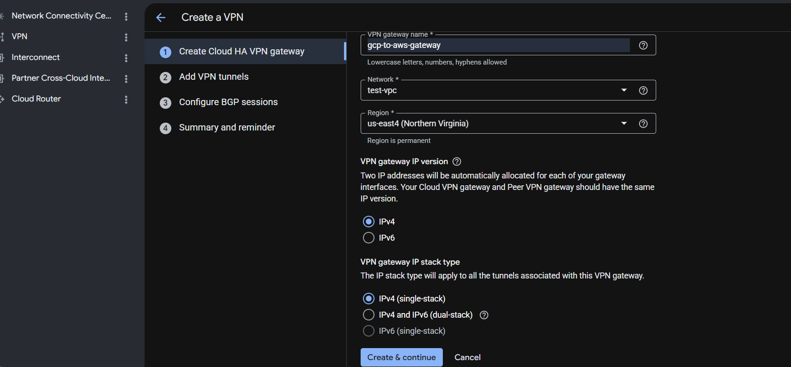

---

# 2. Question: According to RFC 7296, which protocol version is used for modern IKE negotiation?

A. IKEv0

B. IKEv1

**C. IKEv2**

D. ESPv2

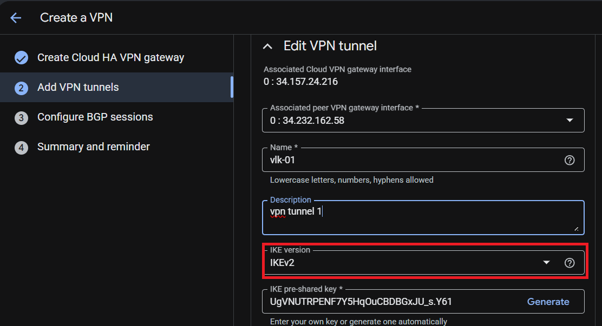

---

# 3. Question: Which UDP port is primarily used for IKE / ISAKMP negotiations?

A. UDP 179

**B. UDP 500**

C. UDP 443

D. UDP 3389

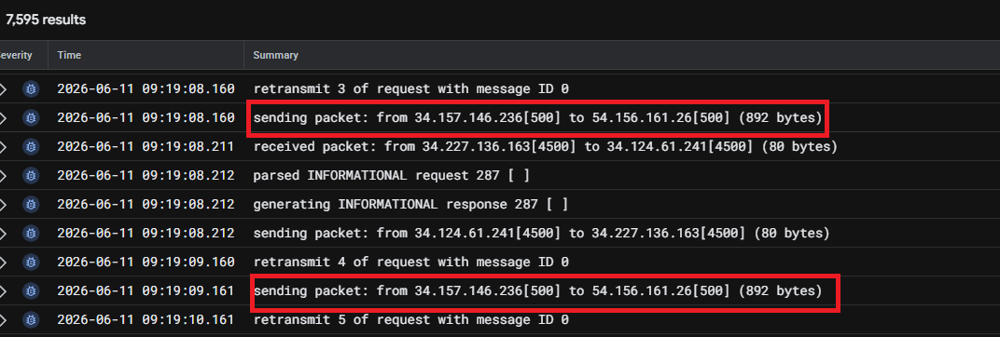

---

# 4. Question: According to RFC 3948, which UDP port is commonly used for NAT Traversal (NAT-T)?

A. UDP 22

B. UDP 80

**C. UDP 4500**

D. UDP 161

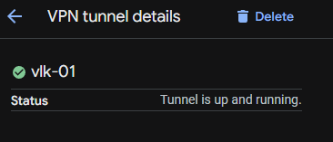

---

# 5. Question: What is the primary purpose of a Pre-Shared Key (PSK) in IPSec?

A. To assign BGP routes

**B. To authenticate VPN peers**

C. To encrypt DNS traffic

D. To replace ESP encryption

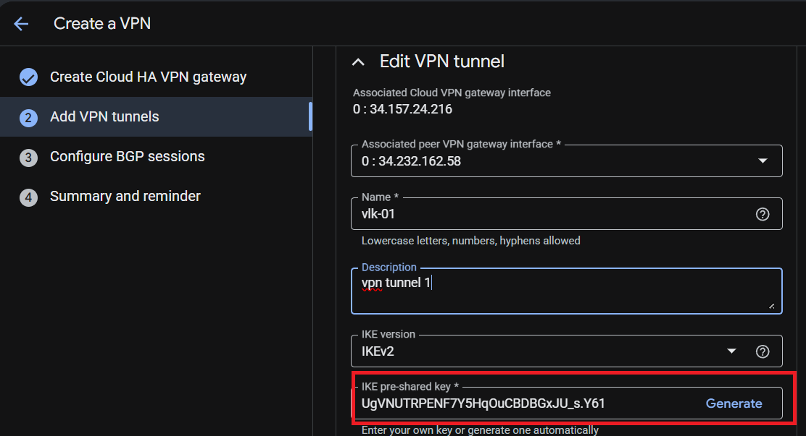

---

# 6. Question: Which IPSec component is responsible for encrypting data traffic?

A. AH

**B. ESP**

C. BGP

D. ICMP

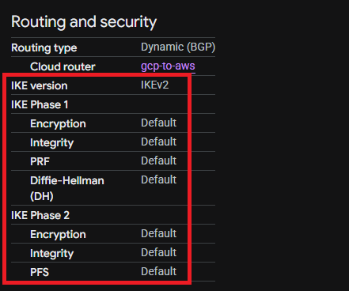

---

# 7. Question: What is the purpose of the Cloud Router in GCP?

A. Encrypt traffic

B. Replace the VPN Gateway

**C. Exchange BGP routing information**

D. Perform DNS resolution

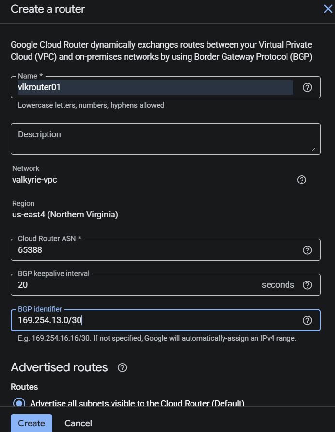

---

# 8. Question: Which RFC defines the Encapsulating Security Payload (ESP)?

**A. RFC 4303**

B. RFC 4271

C. RFC 1918

D. RFC 1035

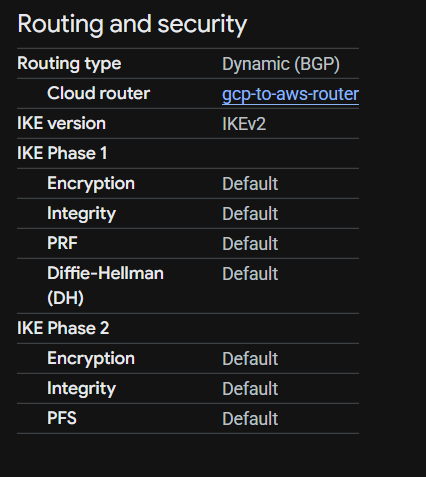

---

# 9. Question: Which protocol and port are used by BGP?

A. UDP 500

**B. TCP 179**

C. TCP 443

D. UDP 161

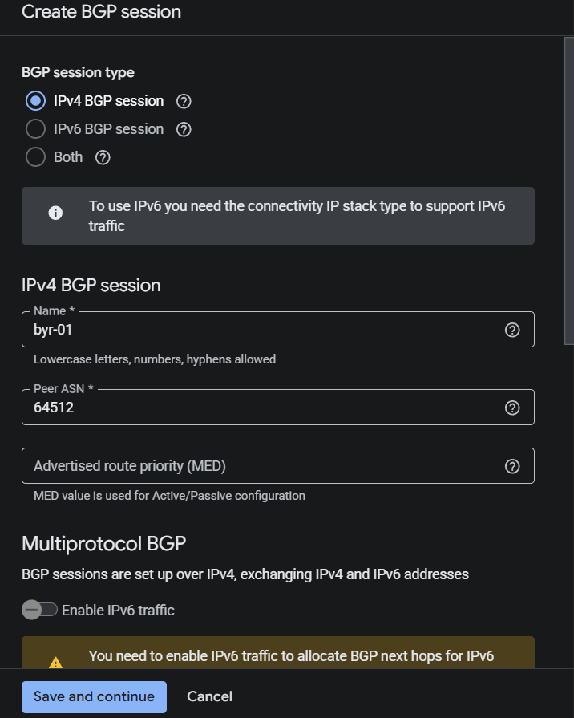

---

# 10. Question: What is the purpose of the 169.254.x.x addresses used in HA VPN BGP sessions?

A. Public Internet routing

B. DNS failover

**C. Link-local BGP peer communication**

D. DHCP assignment

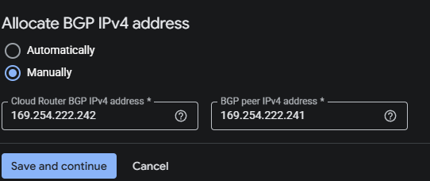

---

# 11. Question: According to RFC 4271, what is the purpose of BGP?

A. Encrypt VPN traffic

**B. Dynamically exchange routing information**

C. Replace TCP

D. Manage DNS records

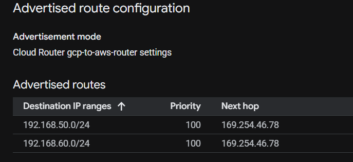

---

# 12. Question: What is the most common cause of Phase 1 IPSec failures?

A. MTU mismatch

B. Incorrect VM subnet

**C. PSK mismatch**

D. DNS timeout

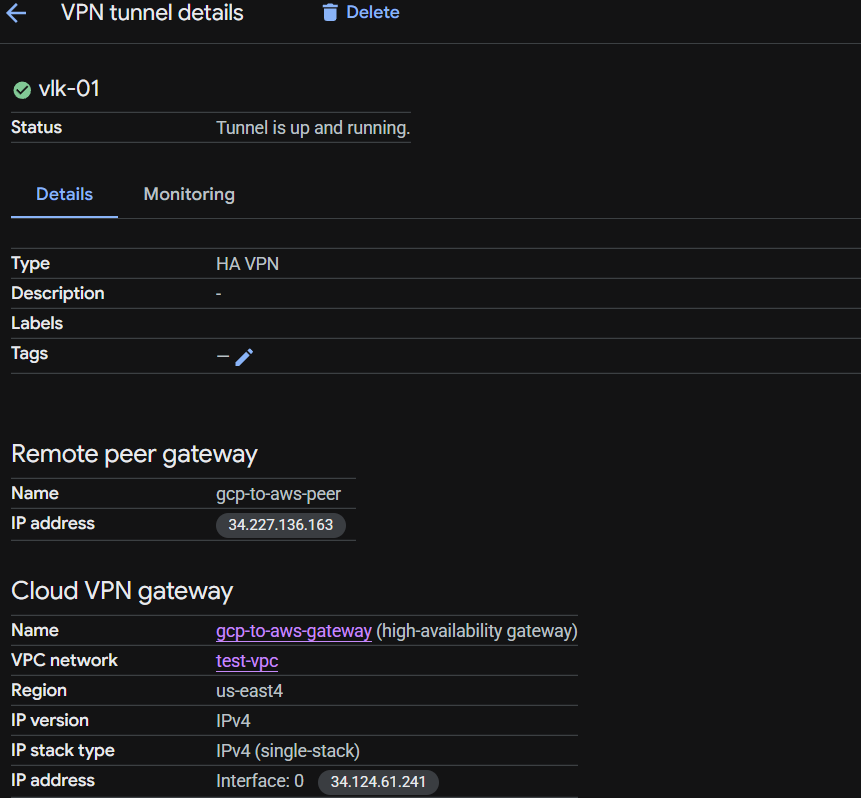
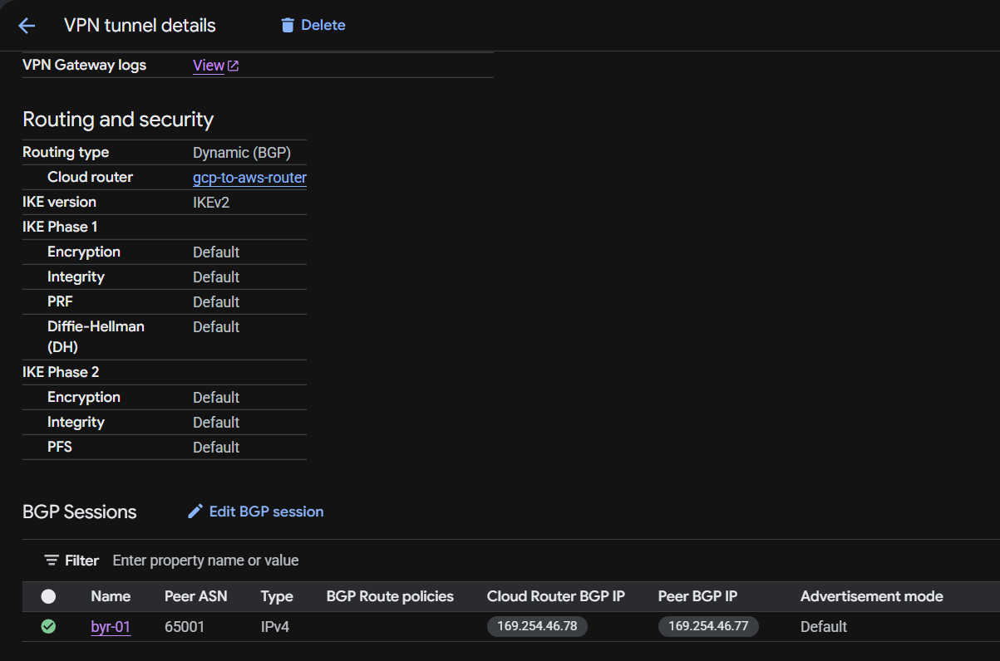

---

# 13. Question: Which of the following is typically configured on both VPN peers?

A. **Different PSKs**

B. Different BGP peer IPs on same side

C. Matching encryption settings

D. Random ASN value

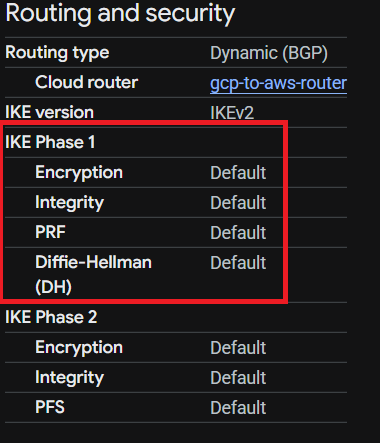

---

# 14. Question: Which GCP component creates the public IP addresses used by the VPN tunnels?

A. Cloud DNS

**B. HA VPN Gateway**

C. Cloud NAT

D. VPC Firewall

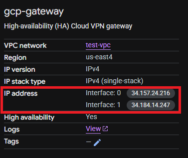

---

# 15. Question: What BGP session state indicates successful route exchange?

A. Idle

B. Connect

C. Active

**D. Established**

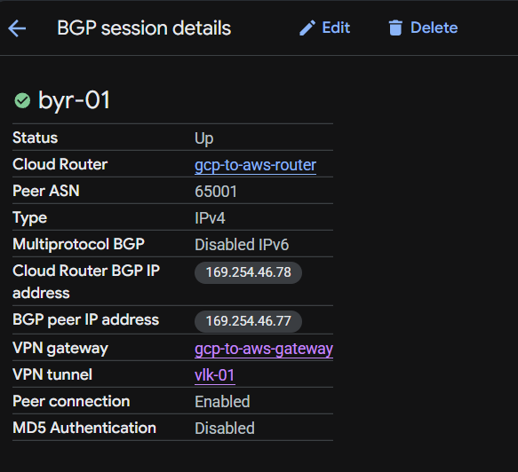

---

# 16. Question: Which IPSec protocol uses IP Protocol 50?

A. AH

**B. ESP**

C. BGP

D. NAT-T

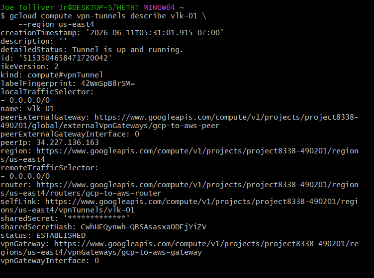
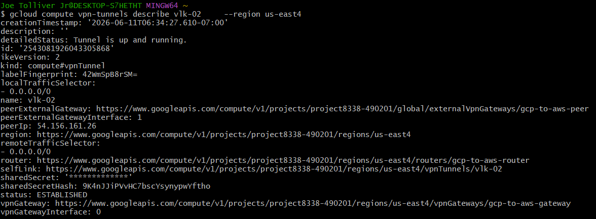

---

# 17. Question: Why do companies commonly deploy dual HA VPN tunnels?

A. To increase DNS speed

**B. For redundancy and failover**

C. To eliminate BGP

D. To disable encryption

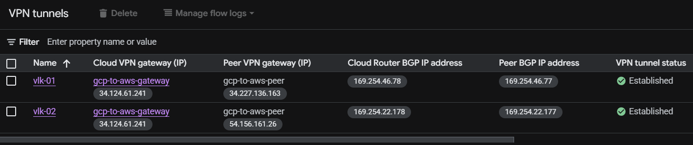

---

# 18. Question: What is the primary purpose of NAT Traversal (NAT-T)?

A. Compress VPN traffic

B. Encrypt DNS queries

**C. Allow IPSec traffic through NAT devices**

D. Replace ESP headers

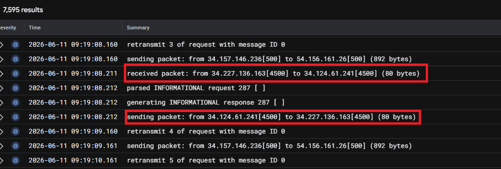

---

# 19. Question: Which of the following best describes a Security Association (SA)?

A. A DNS forwarding table

**B. A set of agreed IPSec security parameters**

C. A static route table

D. A load balancer policy

---

# 20. Question: What is the correct order of IPSec and BGP establishment?

A. BGP → IPSec → IKE

**B. IKE Phase 1 → IPSec Phase 2 → BGP**

C. NAT-T → DNS → ESP

D. Firewall → DNS → BGP

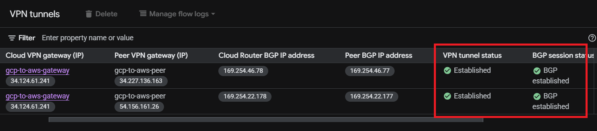

---

# Explain the difference between classic and HA VPN in detail

`Classic Vpn` is a single zone deployment, 1 tunnel vpn and it doesn't have automated failover, its dynamic routing has been deprecated and has a SLA of 99.9%, should be used if looking to be cost-effective.  `HA VPN` is a multi zone deployment you get to pick the region, it has 2 tunnel vpns, it does have automated failover and a SLA of 99.99%, it automatically chooses two external IP addresses, one for each of its interfaces. Each IP address is automatically chosen from a unique address pool to support high availability so it can ensure network operations persist even during gateway failures. It also supports BGP(Border Gateway Protocol) and dynamic routing.

*An analogy would be classic is like a single road, compared to HA which is like a 2 lane road*

# Notes 

**IPsec** is designed to provide interoperable, high quality cryptographically-based security for IPv4 and IPv6.  The set of security services offered includes **access control, connectionless integrity, data origin authentication, detection and rejection of replays (a form of partial sequence integrity), confidentiality (via encryption), and limited traffic flow confidentiality**.  These services are provided at the IP layer, offering protection in a standard fashion for all protocols that may be carried over IP(including IP itself).

Most of the security services are provided through use of two traffic security protocols, the **Authentication Header (AH)** and the **Encapsulating Security Payload (ESP)**, and through the use of cryptographic key management procedures and protocols.

**Encryption** is the process of concealing information by mathematically altering data so that it appears random. In simpler terms, encryption is the use of a "secret code" that only authorized parties can interpret.

A **virtual private network (VPN)** is an encrypted connection between two or more computers. VPN connections take place over public networks, but the data exchanged over the VPN is still private because it is encrypted.

**Encapsulating Security Payload (ESP)** can be used to provide confidentiality, data origin authentication,connectionless integrity, an anti-replay service (a form of partial sequence integrity), and (limited) traffic flow confidentiality.  The set of services provided depends on options selected at the time of Security Association (SA) establishment and on the location of the implementation in a network topology.

*Encapsulating Security Payload (ESP)* ESP encrypts the IP header and the payload for each packet — unless transport mode is used, in which case it only encrypts the payload. ESP adds its own header and a trailer to each data packet.
 
*Note about ESP can be called Encapsulating Security Protocol as was well*

**Authentication Header (AH)** is used to provide connectionless integrity and data origin authentication for IP datagrams (hereafter referred to as just "integrity") and to provide protection against replays.  AH provides authentication for as much of the IP header as possible, as well as for next level protocol data.  However, some IP header fields may change in transit and the value of these fields, when the packet arrives at the receiver, may not be predictable by the sender. The values of such fields cannot be protected by AH.

*Authentication Header (AH)* The AH protocol ensures that data packets are from a trusted source and that the data has not been tampered with, like a tamper-proof seal on a consumer product. These headers do not provide any encryption; they do not help conceal the data from attackers.

**Authentication Header (AH)** may be applied alone, in combination with the IP **Encapsulating Security Payload (ESP)**, or in a nested fashion. 

ESP uses protocol **50**

AH uses protocol **51**

**Security Association (SA)** A simplex (uni-directional) logical connection, created for security purposes.  All traffic traversing an SA is provided the same security processing.  In IPsec, an SA is an Internet-layer abstraction implemented through the use of AH or ESP.  State data associated with an SA is represented in the SA Database (SAD).

*Security Association (SA)* SA refers to a number of protocols used for negotiating encryption keys and algorithms. One of the most common SA protocols is Internet Key Exchange (IKE).

**What IPsec Does**

IPsec creates a boundary between unprotected and protected interfaces, for a host or a network.  Traffic traversing the boundary is subject to the access controls specified by the user or administrator responsible for the IPsec configuration.  These controls indicate whether packets cross the boundary unimpeded, are afforded security services via AH or ESP, or are discarded.

**IKE (Internet Key Exchnage)** is used to negotiate ESP or AH SAs in a number of different scenarios, each with its own special requirements.

**IKE** performs mutual authentication between two parties and establishes an **IKE Security Association (SA)** that includes shared secret information that can be used to efficiently establish SAs for Encapsulating Security Payload (ESP) [ESP] or Authentication Header (AH) [AH] and a set of cryptographic algorithms to be used by the SAs to protect the traffic that they carry.

All **IKE** communications consist of pairs of messages: **a request and a response**.  The pair is called an **"exchange"**, and is sometimes called a **"request/response pair"**.

An IKE message flow always consists of a request followed by a response.  It is the responsibility of the requester to ensure reliability.  If the response is not received within a timeout interval, the requester needs to retransmit the request (or abandon the connection).

The first exchange of an IKE session, **IKE_SA_INIT**, negotiates security parameters for the IKE SA, sends **nonces**, and sends **Diffie-Hellman values**.

The second exchange, **IKE_AUTH**, transmits identities, proves knowledge of the secrets corresponding to the two identities, and sets up an SA for the first (and often only) AH or ESP Child SA (unless there is failure setting up the AH or ESP Child SA, in which case the IKE SA
is still established without the Child SA).

The types of subsequent exchanges are **CREATE_CHILD_SA** (which creates a Child SA) and INFORMATIONAL (which deletes an SA, reports error conditions, or does other housekeeping).  Every request requires a response.  An INFORMATIONAL request with no payloads (other than the
empty Encrypted payload required by the syntax) is commonly used as a check for liveness.  These subsequent exchanges cannot be used until
the initial exchanges have completed.

Internet Protocol Security mostly employs two ports for establishing a secure channel: **UDP port 4500 for scenarios involving Network Address Translation (NAT)** and **UDP port 500 for connection establishment and key negotiation**

**Cloud Router** is a distributed and fully managed offering that provides **Border Gateway Protocol (BGP)** speaker and responder capabilities. 

 The **Border Gateway Protocol (BGP)** is an inter-Autonomous System routing protocol.  The primary function of a BGP speaking system is to exchange network reachability information with other BGP systems.  This network reachability information includes information on the list of **Autonomous Systems (ASes)** that reachability information traverses.

**Border Gateway Protocol (BGP)** can be thought as the postal service of the internet, it chooses a fast, efficient route to deliver information to its recipient (other BGP systems).

BGP uses TCP, BGP listens on **TCP port 179**.  The error notification mechanism used in BGP assumes that TCP supports a "graceful" close (i.e., that all outstanding data will be delivered before the connection is closed).  A **TCP connection** is formed between two systems.  They exchange messages to open and confirm the connection parameters (handshake)

**169.254.x.x** has been reserved for **BGP internal networks**

**Packet** is a small segment of a larger message. Data sent over computer networks*, such as the Internet, is divided into packets. These packets are then recombined by the computer or device that receives them.

When you create an **HA VPN gateway**, Google Cloud automatically chooses **two external IP addresses**, one for each of its interfaces. Each IP address is automatically chosen from a unique address pool to support high availability. Each of the HA VPN gateway interfaces supports multiple tunnels.

In **tunnel mode** the complete original IP packet which includes the header and payload is encrypted and inserted into the brand-new IP packet. This mode is normally used for network-to-network connections.

**Transport mode** encrypts only the payload (records) of the authentic IP packet, leaving the IP header intact. Typically used for end-to-end communication between hosts or gadgets.

# References 

[7296 Internet Key Exchange Protocol Version 2 (IKEv2)](https://datatracker.ietf.org/doc/html/rfc7296#section-1)

[5996 Internet Key Exchange Protocol Version 2 (IKEv2)](https://datatracker.ietf.org/doc/html/rfc5996)

[3948 UDP Encapsulation of IPsec ESP Packets](https://datatracker.ietf.org/doc/html/rfc3948)

[4301](https://datatracker.ietf.org/doc/html/rfc4301)

[4303 Security Architecture for the Internet Protocol](https://datatracker.ietf.org/doc/html/rfc4303)

[4271 BGP Port](https://datatracker.ietf.org/doc/html/rfc4271#section-3)

[4306 Diffie-Hellman](https://datatracker.ietf.org/doc/html/rfc4306#section-2.10)

[6071 IPsec and IKE](https://datatracker.ietf.org/doc/html/rfc6071)

[4301 IP Authentication Header](https://datatracker.ietf.org/doc/html/rfc4302)

[3947 Negotiation of NAT-Traversal in the IKE](https://datatracker.ietf.org/doc/html/rfc3947)

[ikev2](https://www.paloaltonetworks.com/cyberpedia/what-is-ikev2)

[AH](https://www.geeksforgeeks.org/computer-networks/internet-protocol-authentication-header/)

[ESP](https://www.hypr.com/security-encyclopedia/encapsulating-security-payload-esp)

[IPsec](https://www.zenarmor.com/docs/network-basics/what-are-ports-used-for-ipsec)*

[UDP](https://www.cloudflare.com/learning/ddos/glossary/user-datagram-protocol-udp/)

[What are Packets?](https://www.cloudflare.com/learning/network-layer/what-is-a-packet/)*

[Cloud Routers](https://docs.cloud.google.com/network-connectivity/docs/router/concepts/overview)

[What is BGP?](https://www.cloudflare.com/learning/security/glossary/what-is-bgp/)*

[What is a VPN Tunnel?](https://www.paloaltonetworks.com/cyberpedia/what-is-a-vpn-tunnel)

[HA VPN](https://docs.cloud.google.com/network-connectivity/docs/vpn/concepts/overview#ha-vpn)

[Tunnel and Transport Modes](https://www.geeksforgeeks.org/computer-networks/ipsec-internet-protocol-security-tunnel-and-transport-modes/)

[BGP States](https://www.logicmonitor.com/deep-dive/bgp-monitoring/bgp-states)*

[BGP Fundamentals](https://support.huawei.com/enterprise/en/doc/EDOC1100459015/df25b78f/bgp-fundamentals)

[Classic vs HA VPN](https://gcpstudyhub.com/blog/cloud-vpn-for-the-pca-exam-classic-vs-ha-gateway)

