## Runbook

`Goal` to setup a functioning GCP VPN using the classic vpn route based mode settings

**Section 1 VPC GCP & AWS**

Create an vpc if needed, if one is already created make sure to make a note of the ip range you are going to need it later (0.0.0.0/0) for test purposes.  Once thats been established go to the next part.

- Next in GCP go in the search bar type in IP Address, then click reserve external then name, change the region and reserve it.
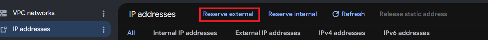

Now the AWS side needs to be completed

**Section 2 AWS**
 - First the person on the aws side will create the vpn first so they should go to the customer gateway under Virtual Private Network(VNP) 
 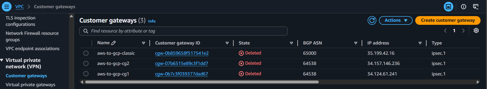

- Create Customer Gateway click on create customer gateway, and configure the customer gateway name it -> ASN leave default -> ip address this is the static ip address created in GCP then click create customer gateway
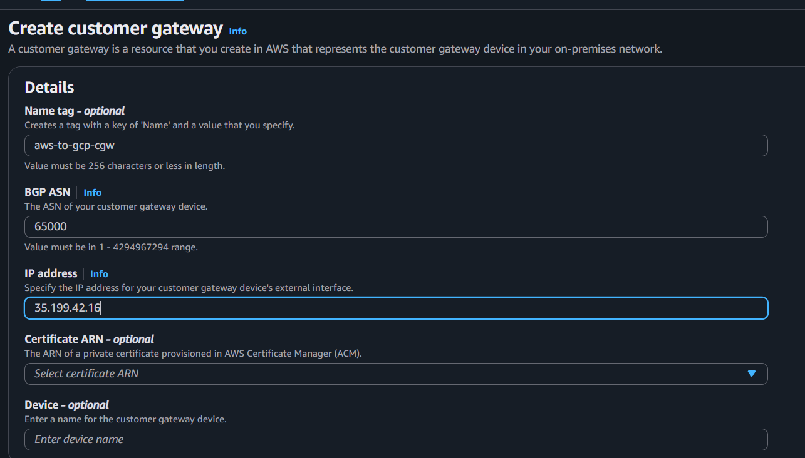
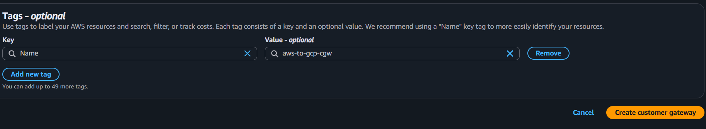

 - Next go to the Virtual Private Gateway click on create virtual private gateway and configure it as well leave everything default, but give it a name, then click on create virtual private gateway button.  Then click on the created virtual private gateway and click the Action button and select attach vpc to attach virtual private gateway to the vpc.
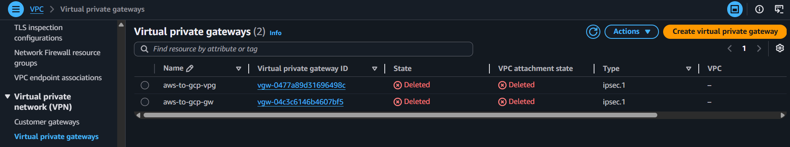
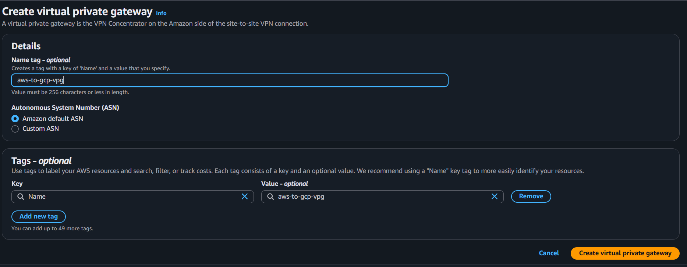
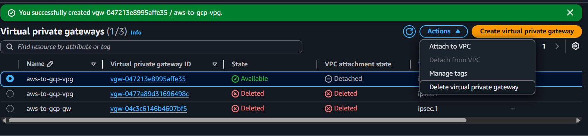
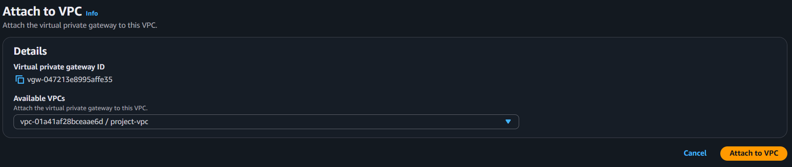

 - Finally go to Site-to-Site click on create vpn connection, configure the vpn connection, name -> choose the customer and virtual gateways.  Choose static for routing option the static ip prefix is the static ip that was created, after that go to the bottom and click on the create vpn connection button.  
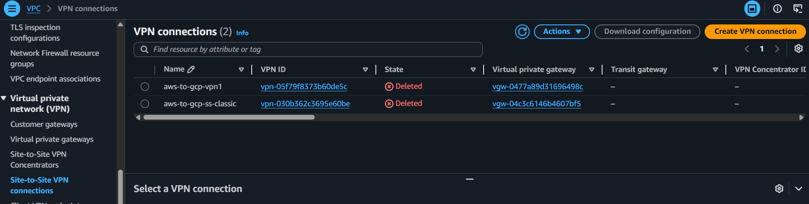
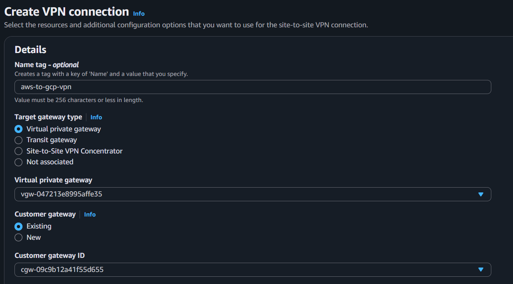
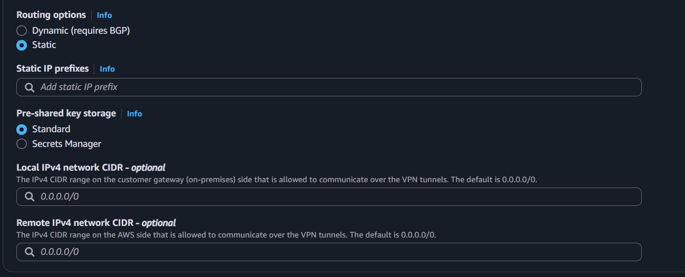
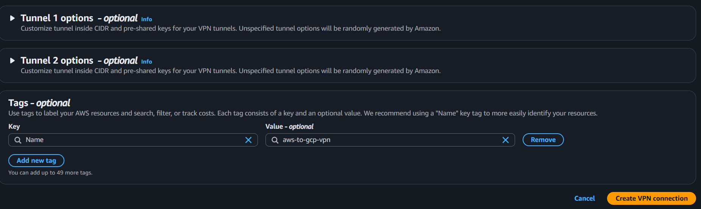

 - Click on Download Configuration and click generic for the vendor it auto fills the rest of the options, change the IKE version to ikev2 then click download.
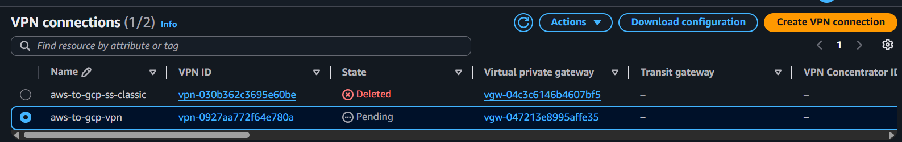
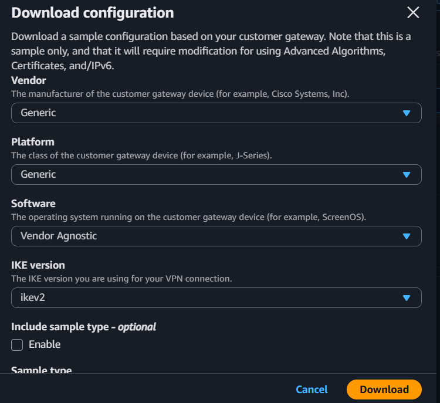

 **Section 3 GCP** 
 - Now on the GCP side, in the search bar type in VPN and click on Vpn and click on create vpn connection, click classic vpn and click continue, to configure Google Compute Engine VPN Gateway.  The ip address can also be created from here, click create IP address and reserve.
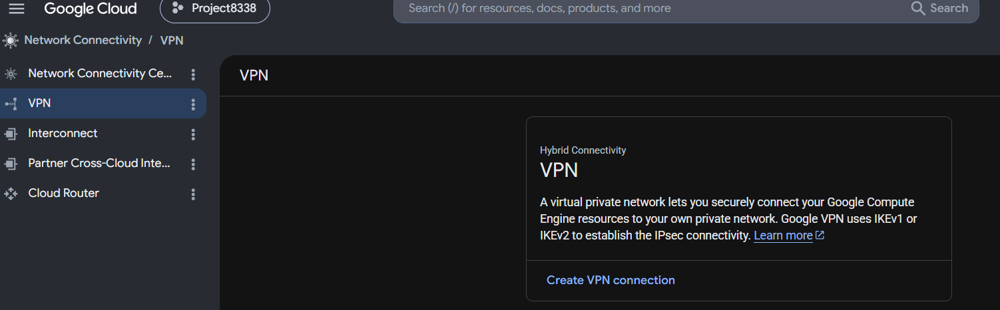
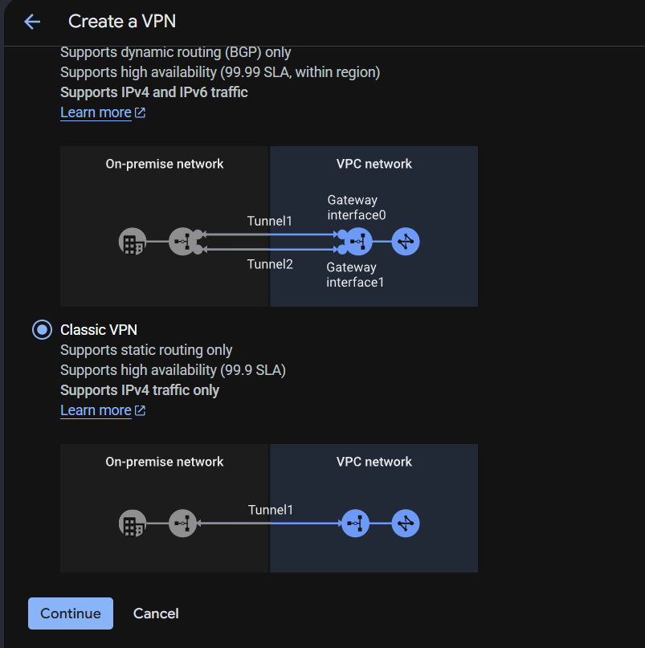
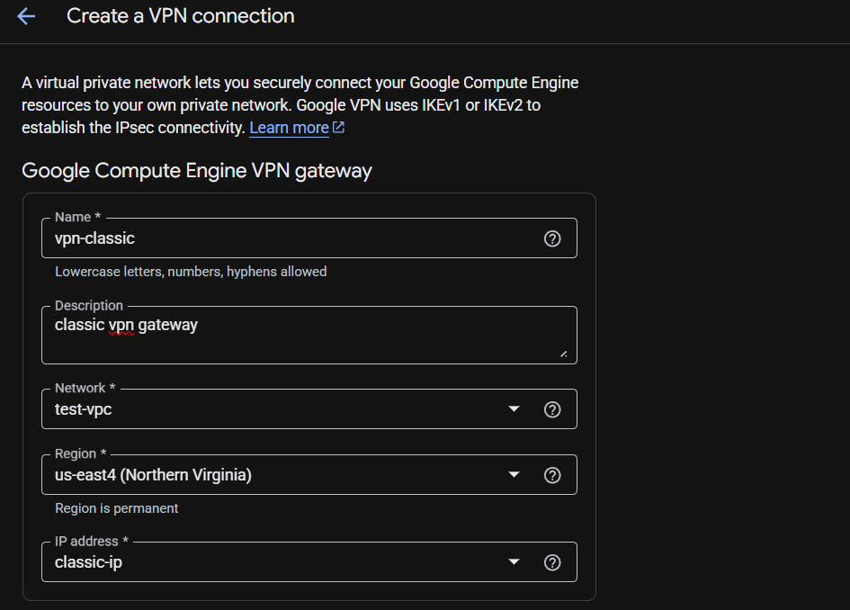
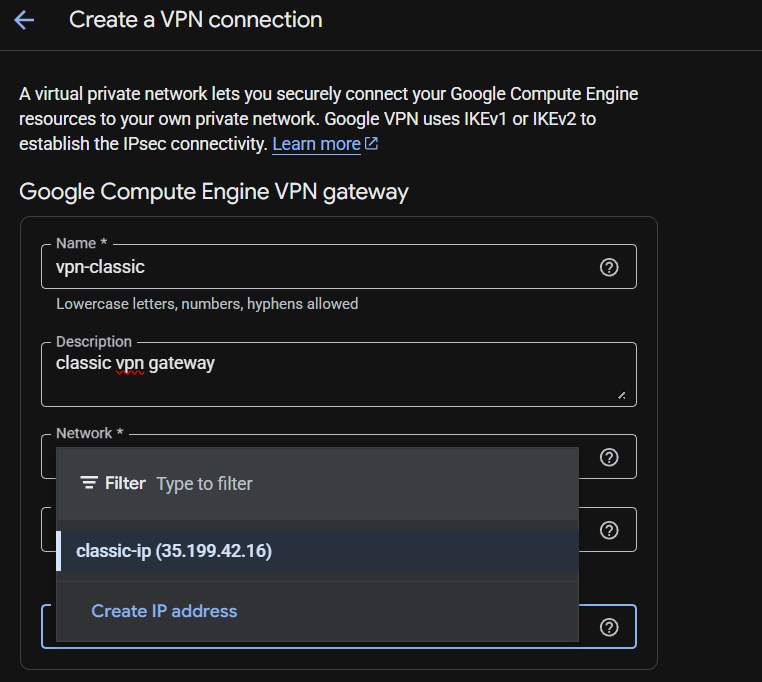
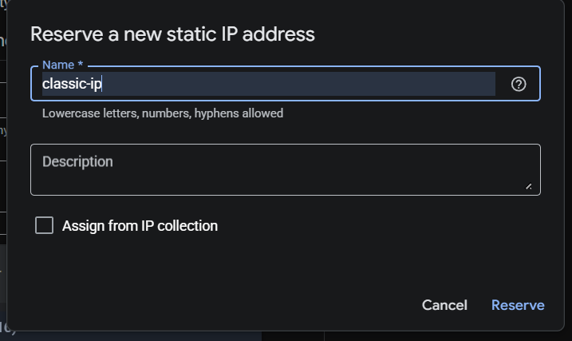

 - The person on the aws side needs to give the download file to the person on the gcp side.  Now the tunnels can be created name the tunnel, 2 things needed are the outside ip address virtual private gateway for the remote peer ip address and the PSK for the IKE PSK, make sure to be using ikev2.  After this is finished click done and repeat the process with the 2nd ipsec information for the aws download.  When both are complete click create.
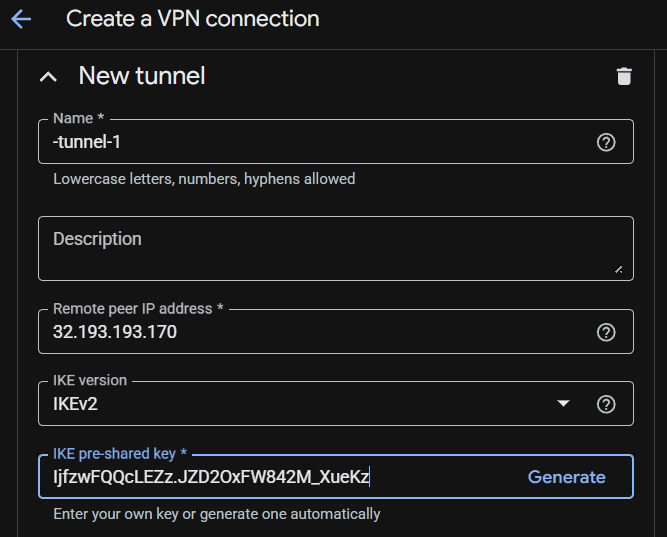
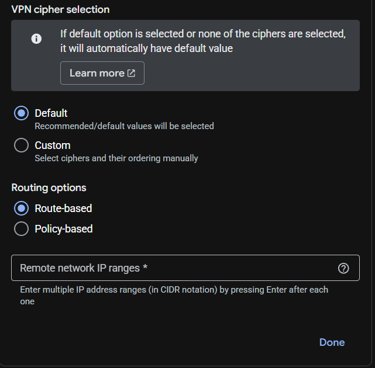
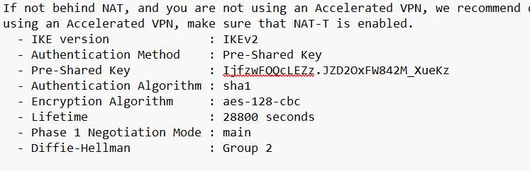
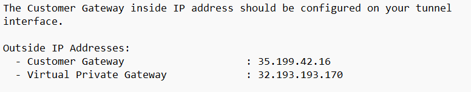

 **Section 4 Connection**
- If everything is done correctly you will get the established for GCP and up for AWS.
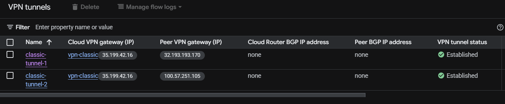
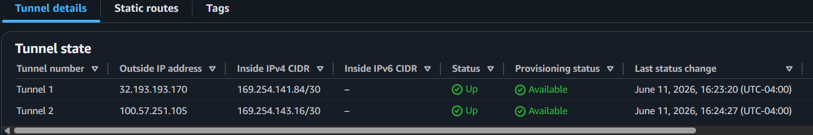

## Author & Contributors

**Author:** `Joe Tolliver`

**Contributors:** `Cautchy Bailly`, `Kamau Jermaine`, `Xavier Edward`, `Jacques Payne`

**Group Leader:** `Jacques Payne`

**Group Name:** `T.K.O.`

**Date:** `6/11/2026`

**Version:** `1.0`