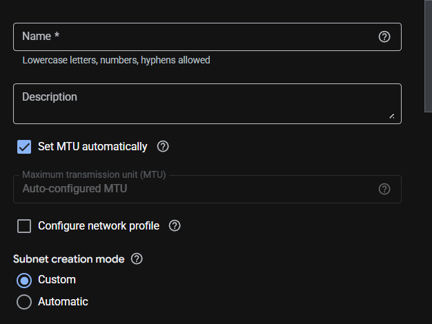
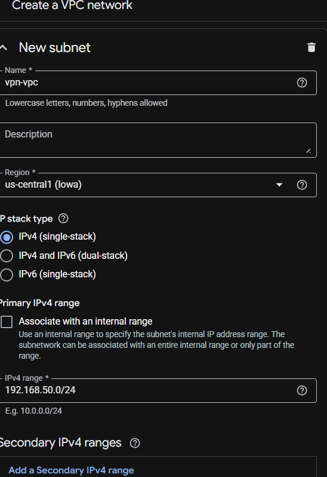
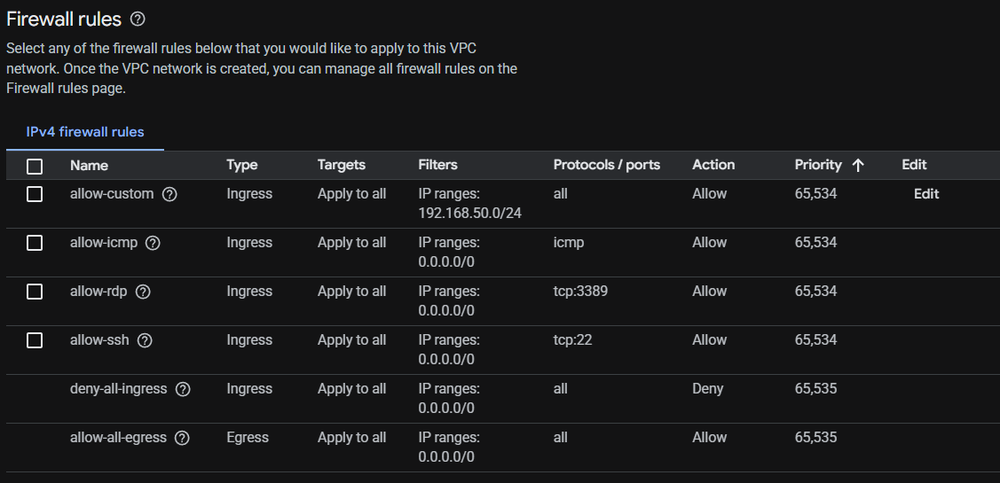
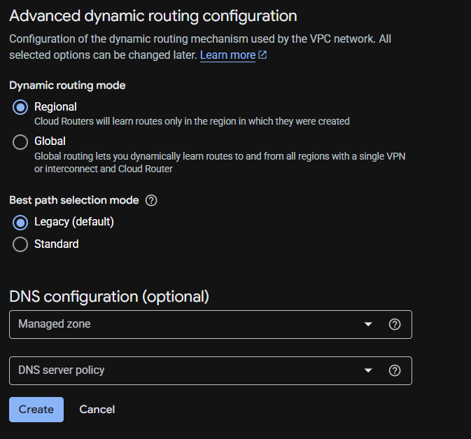
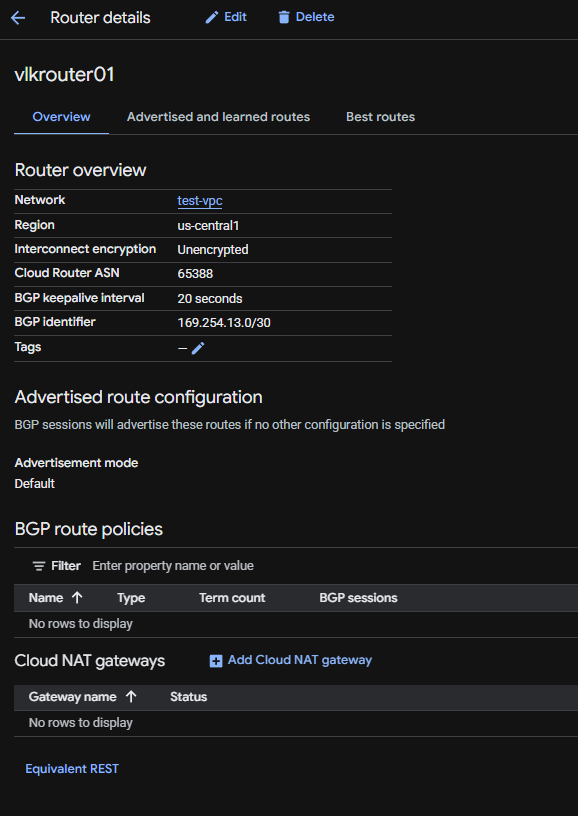
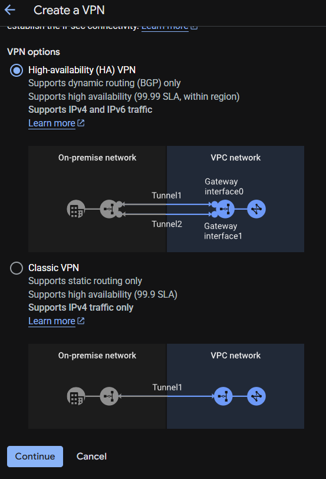
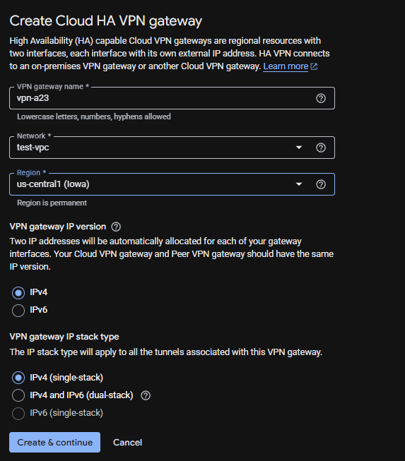

# Runbook

Goal to create a 2 HA VPN with cross account and connect VPC networks.  Also Use Network Intelligence Center to test connectivity between two VMs in the account

**Section 1**

Create a vpc and subnet, go to vpc network and click on create vpc network name it, leave MTU as is, then create new subnets around 2 and turn on flow logs as well.  Once that is done add the firewall rules that will be used for the vpc, set up dynamic routing mode and leave the rest default click Create.

**Section 2**

First create a Cloud router go to the search bar and type in Cloud Router and click on it and click on create router, give it a name, description, network, region, Cloud Router ASN (between 64512 to 65534), BGP keepalive 20 seconds, BGP identifier.  Advertised routes default and click Create. 

Next go to VPN and click on ceate vpn connection and choose High-availabilty (HA) VPN and click Continue at the bottom.

Create the HA Vpn gateway now, give it a name, choose network, and choose the region both accounts must use the same region, use IPv4 for both click Create & continue at the bottom

Next create the vpn tunnels

