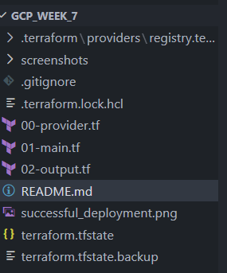
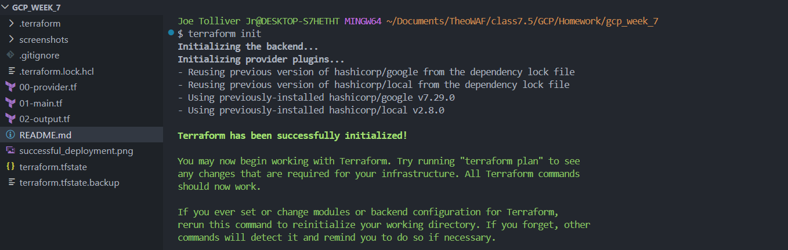
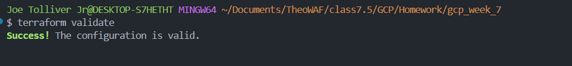
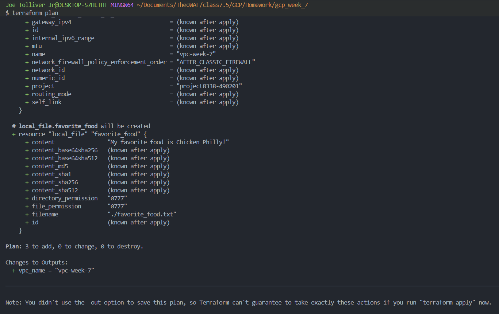
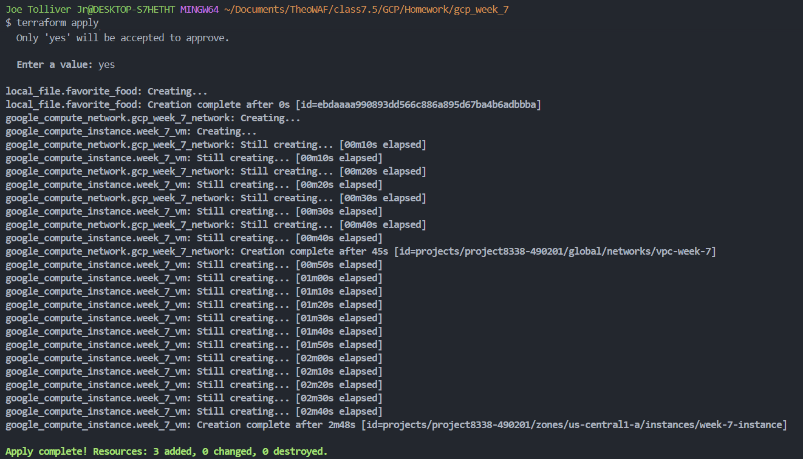
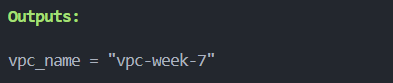
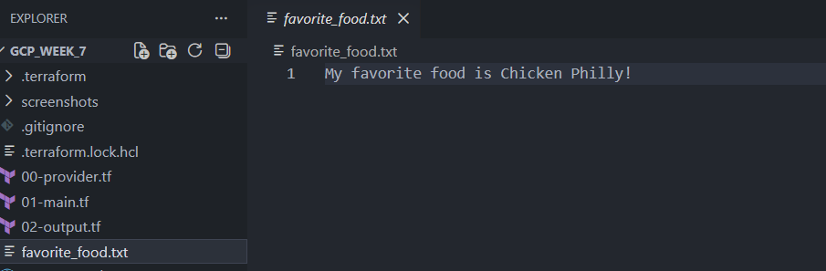
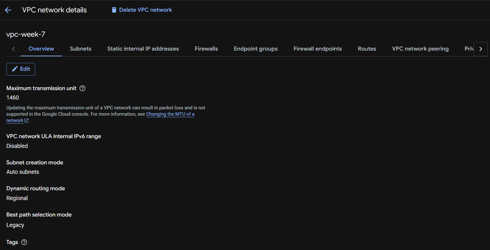
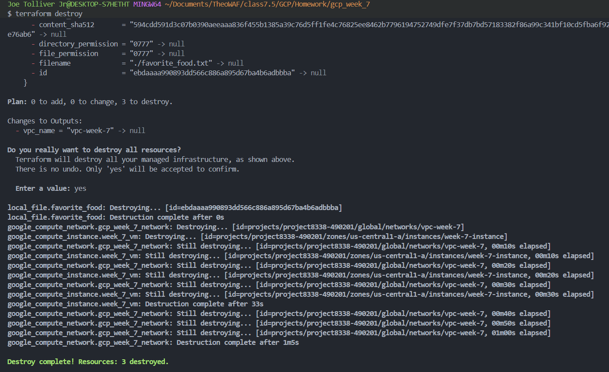

# GCP VPC Terraform Lab


## 1. Title: What Is This Lab Supposed to Do?

This lab demonstrates how to use **Terraform** to provision a basic **Google Cloud Platform VPC network**, create a local file using Terraform's `local_file` resource, and output the created VPC name after deployment.

The goal is to practice core Infrastructure as Code concepts with Terraform and GCP, including provider configuration, resource creation, local artifact generation, outputs.

---

## 2. Custom Badges

The badges above show the main tools and technologies used in this project:

- **Terraform** for Infrastructure as Code
- **Google Cloud Platform** for cloud networking
- **Google Provider** for Terraform resource management
- **Git** for source control
- **Lab Documentation Ready** to show this project is ready to be submitted or shared

---

## 3. Lab Overview

This lab Terraform is used to build a simple GCP networking environment. The lab includes a provider configuration file using the latest Google provider version, a GCP VPC resource based on Terraform Registry examples, a local text file created by Terraform, and an output block that displays the VPC name.

A remote backend is **not required** for this lab. Instead, a `.gitignore` is being used in its place.

This lab helps build confidence with:

- Writing Terraform configuration files
- Initializing Terraform providers
- Creating GCP infrastructure
- Using Terraform outputs
- Creating local files with Terraform

---

## 4. Lab Requirements

### Required Tools

| Requirement | Needed? | Purpose |
|---|---:|---|
| Terraform | Yes | Used to create and manage the GCP VPC and local file resource |
| GCP Console | Yes | Used to verify that the VPC was created successfully |
| Git | Yes | Used for version control and managing project files |
| `.gitignore` | Yes | Used to keep Terraform state and local files out of Git |


### GCP Requirements

- Active GCP account
- GCP project created
- Terraform authenticated to GCP

### Terraform Resources Used

- `google_compute_network`
- `local_file`
- `output`

---

## 5. Project/Folder Structure

Example project structure:

```text
gcp-vpc-terraform-lab/
├── screenshots
    ├── 01-provider_folder.png
    ├── 02-terraform_init.png
    ├── 03-terraform_validate.png
    ├── 04-terraform_plan.png
    ├── 05-terraform_apply.png
    ├── 06-output.png
    ├── 07-local_file.png
    ├── 08-console_vpc_verification.png
    ├── 09-terraform_destroy.png

├── .gitignore
├── 00-provider.tf
├── 01-main.tf
├── 02-outputs.tf
├── favorite_food.txt         # Created by Terraform after apply

└── README.md
```

### File Purpose

| File | Purpose |
|---|---|
| `provider.tf` | Configures Terraform and the Google provider |
| `main.tf` | Creates the GCP VPC and local text file |
| `outputs.tf` | Displays the VPC name after deployment |
| `.gitignore` | Prevents Terraform state and local files from being committed |
| `README.md` | Documents the lab steps, screenshots, teardown, and lessons learned |

---

## 6. Steps Used to Complete This Lab

### Step 1: Create the Project Folder

Create a new folder for the lab. This folder should not be inside another Git repository.

```bash
mkdir gcp_week_7
cd gcp_week_7
```

Confirm the folder location:

```bash
pwd
```

Open the folder in VS Code:

```bash
code .
```

---

---

### Step 2: Configure the Terraform Google Provider

Create a file named `provider.tf`:

```bash
touch provider.tf
```

Example `provider.tf`:

```hcl
terraform {
  required_providers {
    google = {
      source  = "hashicorp/google"
      version = "7.29.0"
    }
  }
}

provider "google" {
  project = "your_project_name"
  region  = "region_you_are_using"
}
```

Replace `your_project_name` with your actual GCP project ID.

---


### Step 3: Create the GCP VPC and Local File Resource

Create a file named `main.tf`:

```bash
touch main.tf
```

Example `main.tf`:

```hcl
resource "google_compute_instance" "week_7_vm" {
  name         = "week-7-instance"
  machine_type = "e2-micro"
  zone         = "us-central1-a"

  boot_disk {
    initialize_params {
      image = "debian-cloud/debian-12"
    }
  }

network_interface {
    network = "default"

    access_config {}
  }
}

#VPC

resource "google_compute_network" "gcp_week_7_network" {
  name = "vpc-week-7"
}

#LOCAL FILE

resource "local_file" "favorite_food" {
  content  = "My favorite food is Chicken Philly!"
  filename = "${path.module}/favorite_food.txt"
}
```

This creates:

1. A custom-mode GCP VPC named `gcp_week_7`
2. A local text file named `favorite_food.txt`

You can change `pizza` to your actual favorite food.

---

### Step 4: Create the Terraform Output Block

Create a file named `outputs.tf`:

```bash
touch outputs.tf
```

Example `outputs.tf`:

```hcl
output "vpc_name" {
    description = "VPC output name"
    value       = google_compute_network.your_vpc.name
}
```

This output displays the VPC name after `terraform apply` finishes.

---

### Step 5: Format the Terraform Code

Run:

```bash
terraform fmt
```

This automatically formats Terraform files in the project folder.

---

### Step 6: Initialize Terraform

Run:

```bash
terraform init
```

Terraform downloads the required provider plugins, including:

- `hashicorp/google`
- `hashicorp/local`

---

### Step 7: Validate the Terraform Configuration

Run:

```bash
terraform validate
```

Expected successful result:

```text
Success! The configuration is valid.
```

---

### Step 8: Review the Terraform Plan

Run:

```bash
terraform plan
```

Review the planned resources. You should see Terraform planning to create:

- One GCP VPC network
- One local file

---

### Step 9: Apply the Terraform Configuration

Run:

```bash
terraform apply
```

When prompted, type:

```text
yes
```

After deployment, Terraform should display an output similar to:

```text
Outputs:

vpc_name = "vpc-week-7"
```

---

### Step 10: Verify the Local File Was Created

Run:

```bash
ls
```

Then view the file:

```bash
cat favorite_food.txt
```

Expected example output:

```text
My favorite food is your_favorite_food.
```

---

### Step 11: Verify the VPC in GCP Console

In the GCP Console:

1. Go to **VPC network**
2. Select **VPC networks**
3. Look for the VPC named `vpc-week-7`
4. Confirm that it was created successfully
5. Confirm whether it is custom mode, depending on your configuration

 Verify the VPC with `gcloud`

Terminal Command:

```bash
gcloud compute networks list
```
---

## 7. Artifacts/Screenshots

Use this section to show proof of your work. Add screenshots after completing the lab.

### Screenshot 1: Project Folder in VS Code

Add a screenshot showing your project folder and Terraform files.



Description:

- VS Code project folder with provider.tf, main.tf, outputs.tf, .gitignore, and README.md

---

### Screenshot 2: Terraform Init Successful



Description:

- Terraform init completed successfully.

Recommended command:

```bash
terraform init
```

---

### Screenshot 3: Terraform Validate Successful



Description:

- Terraform validate showing success

Recommended command:

```bash
terraform validate
```

---

### Screenshot 4: Terraform Plan Output



Description:

- Terraform plan showing resources to be created

Recommended command:

```bash
terraform plan
```

---

### Screenshot 5: Terraform Apply Complete



Description:

- Terraform apply showing Apply complete

Recommended command:

```bash
terraform apply
```

---

### Screenshot 6: Terraform Output Showing VPC Name



Description:

- Output showing vpc_name

Recommended command:

```bash
terraform output
```

Expected example:

```text
vpc_name = "your_vpc_name"
```

---

### Screenshot 7: Local File Created by Terraform



Description:

- favorite_food.txt file created

Recommended commands:

```bash
ls
cat favorite_food.txt
```

---

### Screenshot 8: GCP Console VPC Verification



Description:

- GCP Console showing vpc-week-7 under VPC networks

---

### Screenshot 9: Terraform Destroy



Description:

- Terraform destroy showing resources being destroyed


## 8. Steps Used to Teardown or Destroy the Infrastructure/Resources

To avoid unnecessary cloud charges and keep the GCP environment clean, destroy the Terraform-managed resources after verification.


### Step 1: Destroy the Resources

Run:

```bash
terraform destroy
```

When prompted, type:

```text
yes
```

---

### Step 2: Confirm Destroy Completed

Terraform should show something similar to:

```text
Destroy complete! Resources: 3 destroyed.
```

---

### Step 3: Verify the VPC Was Removed

Use the GCP Console:

1. Go to **VPC network**
2. Select **VPC networks**
3. Confirm `vpc-week-7` is no longer listed

Optional CLI command:

```bash
gcloud compute networks list
```

---

## 9. Lessons Learned

### What Did I Learn While Building This Lab?

This lab showed how Terraform can manage both cloud resources and local files. The main infrastructure resource was a GCP VPC network, while the `local_file` resource proved that Terraform can also create local artifacts during deployment.

### What Is Relatable to the User or Customer?

A customer or user may need repeatable infrastructure that can be deployed the same way every time. Instead of manually creating VPCs in the GCP Console, Terraform allows the network configuration to be documented, version-controlled, reviewed, and reused.

### What Struggles Came Up During This Project?

Possible challenges included:

- Writing the output block correctly

---

## 10. References

### Terraform/Google Documentation

- Terraform Google Provider Documentation: https://registry.terraform.io/providers/hashicorp/google/latest/docs
- Terraform Google Compute Network Resource: https://registry.terraform.io/providers/hashicorp/google/latest/docs/resources/compute_network
- Terraform Google Compute Network Instance: https://registry.terraform.io/providers/hashicorp/google/latest/docs/resources/compute_instance
- Terraform Local File Resource: https://registry.terraform.io/providers/hashicorp/local/latest/docs/resources/file
- Terraform Output Values: https://developer.hashicorp.com/terraform/language/values/outputs
- Google Cloud VPC Documentation: https://cloud.google.com/vpc/docs


---

## 11. Troubleshooting Section

### Common Issues and Fixes

| Issue | Possible Cause | Fix |
|---|---|---|
| `terraform init` fails | Provider version issue or network issue | Check internet connection and provider block |
| `terraform validate` fails | Syntax error in `.tf` file | Review braces, quotes, and resource names |
| GCP authentication error | Not logged in or wrong credentials | Run `gcloud auth application-default login` |
| Wrong project used | Incorrect project ID in provider | Update `project` in `provider.tf` |
| VPC not visible in Console | Wrong GCP project selected | Check project selector in GCP Console |
| Output does not show | Output block missing or incorrect | Confirm `outputs.tf` references the correct resource |
| Local file not created | `local_file` resource missing or failed | Check `main.tf` and run `terraform apply` again |
| Git wants to track state file | `.gitignore` missing or incomplete | Add Terraform state patterns to `.gitignore` |

---

## 12. Author & Contributors

**Author:** `Joe Tolliver`

**Contributors:**

**Group Leader:** `Jacques Paune`

**Group Name:** `T.K.O.`

**Date:** `4/29/2026`

**Version:** `1.0`
