# Terraform 

The mandatory (required) arguments for a VM in terraform 
- boot_disk = boot disk for  the instance 
- machine_type = to create
- name = unique for the resource
- network_interface = networks to attach

[Required Arguments](https://registry.terraform.io/providers/hashicorp/google/3.40.0/docs/resources/compute_instance#argument-reference)

create a output block and add those 2 attributes references in the code to get the both internal and external ip addresses.  
- internal ip = network_interface.0.network_ip
- external ip = network_interface.0.access_config.0.nat_ip
I figured it out by reading through the terraform registery documentation google_compute_instance and looking for a reference that made mention of internal and external ip addresses.

[Internal IP](https://registry.terraform.io/providers/hashicorp/google/3.40.0/docs/resources/compute_instance#network_interface.0.network_ip-3)

[External IP](https://registry.terraform.io/providers/hashicorp/google/3.40.0/docs/resources/compute_instance#network_interface.0.access_config.0.nat_ip-3)

[Output](https://developer.hashicorp.com/terraform/language/block/output)
    
[Google Outputs](https://developer.hashicorp.com/terraform/tutorials/gcp-get-started/google-cloud-platform-outputs)

2 non-required arguments
- zone = is the zone the resource is created in, if not given the default is whatever the provider block is set to.
- project =  the project id which the resource is assign to, similar to the zone if not given the default is based on the one given in the provider block.

I would go into the google cloud console, go to create an instance, click on OS and storage, click on change and under public image change the operating system to CentOS and choose the Version.

All are different forms of identifers for resources: name is a identifer created by you and must be unique, id is a formatted identifier for a resource, uri is a identifier for the address of the resource.

# Runbook 

Goal: to create a fully configured managed instance group in clickops, with autoscaling, autohealing, and health checks enabled, and be able to verify the group will manage across multiple zones.

Prerequisites:
- Google Cloud Account
- Instance Template

Steps
---
1. **Instance Template**
- Make sure you have a instance template this is how base of the managed instance group.
---
2. **Create Instance Group**
- Click on the 3 hash sign in the top left corner, on the side bar click on Compute Engine, then click on the Instance Group pop-out.
Click on Create Instance 
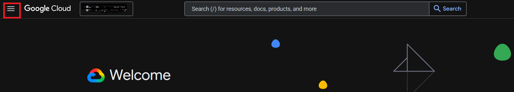
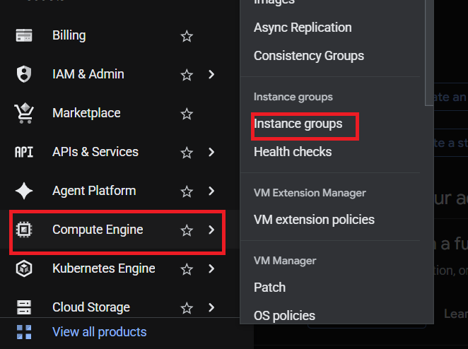
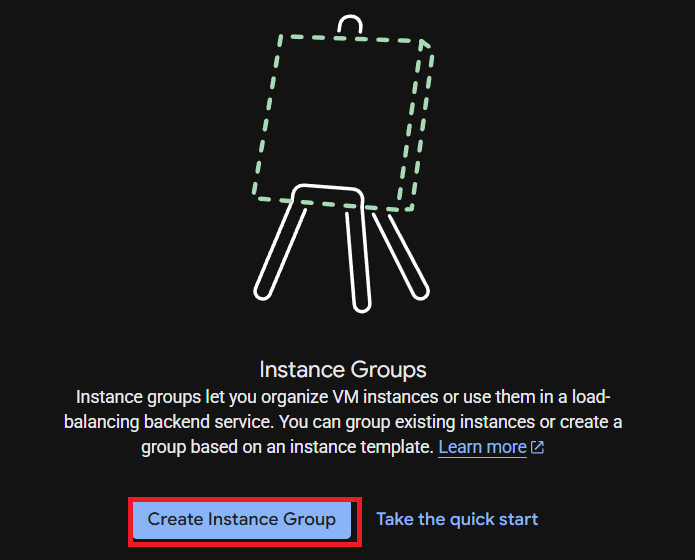

---
3. **Multiple Zones Set-up**
- Once inside name it and choose the instance template from the drop down.  
Go to Location and choose Multiple Zones, make sure its in the correct region, the zones are correct, and set the target distribution shape.
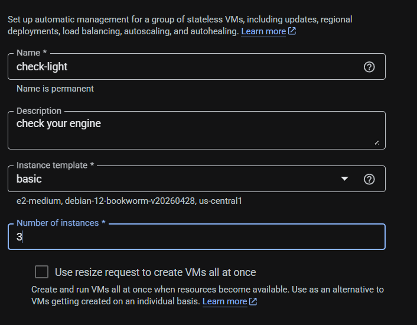
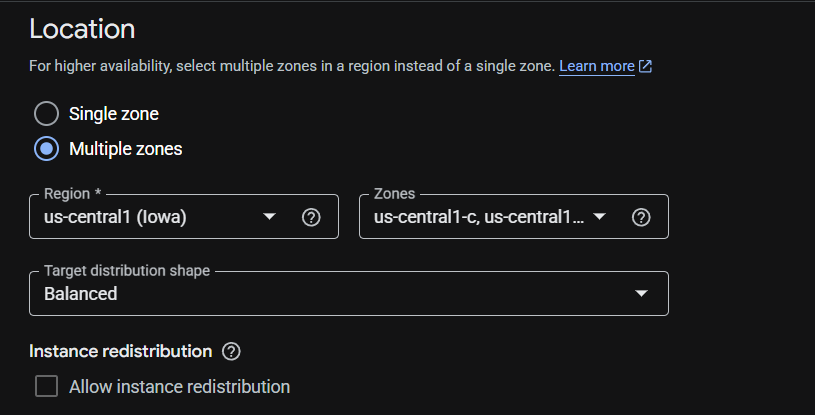
---

4. **Autoscaling Set-up**
- Click on Configure Autoscaling in the Autoscaling section set Autoscaling mode and set the min and max number of instances.
Set Autoscaling signals and Predictive autoscaling. 
Autoscaling schedules leave default
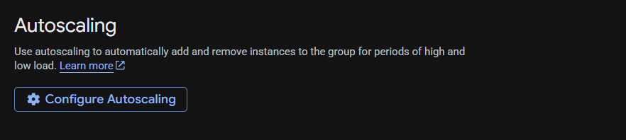
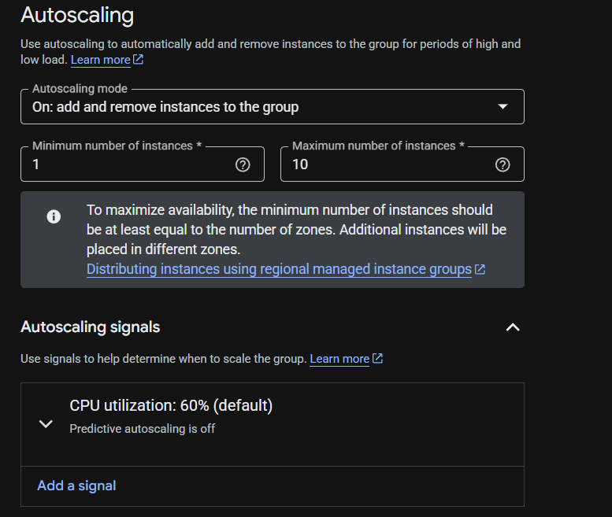
---

5. **VM Instance Lifecycle**
- Action on failure leave default
Set-up autohealing, click on Health check and the dropdown and click on Create a health check
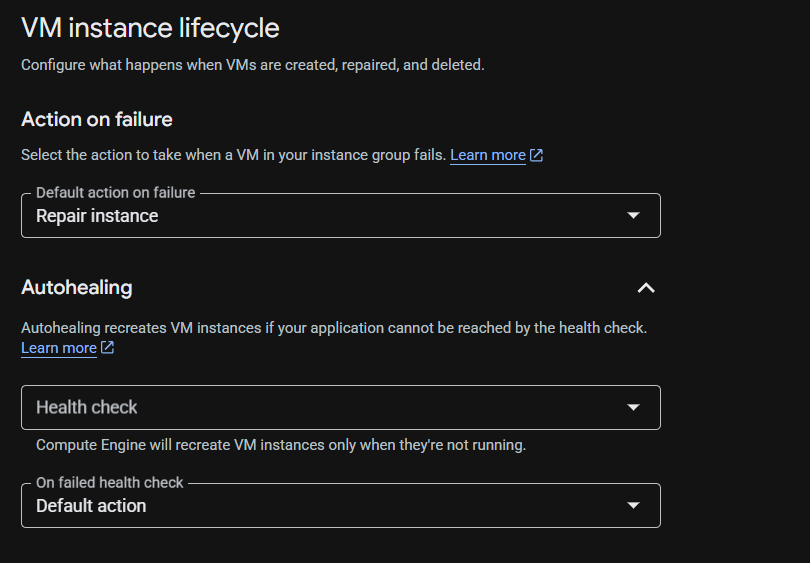
---

6. **Health Check Set-up**
- Name it and give it a description
Scope = Regional
Protocol = TCP
Port = 80
Logs = On
Health criteria leave default click save to create the health check.
Leave the rest default and click on Create at the bottom to create the Instance Group.
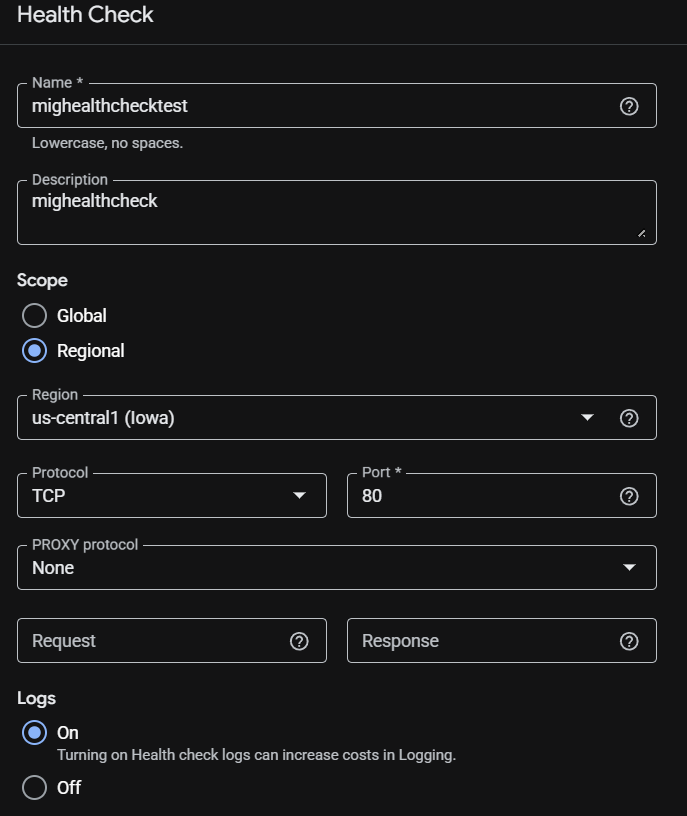
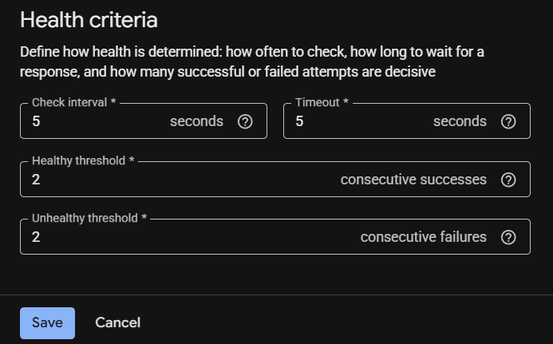
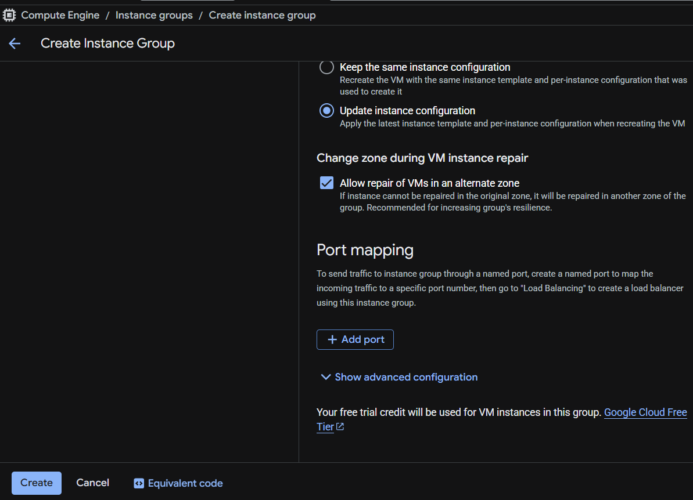
--- 

7. **Verify Multiple Zones**
- To verify Multiple Zones go to the Instance Group look at the instance group and lookat the location
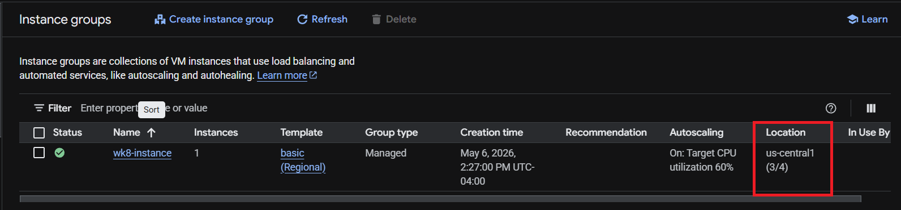

# Q & A 

- What is the difference between high availability and fault tolerance? Which is best to strive for?

    High Availability is to ensure an agreed level of operational performance think reliability and fault tolerance is a systems's ability to continue operating despite failures or malfunctions.  I believe the best to strive for is fault tolerance especially in a production setting as any downtime can cost companys millions of dollars.  

    [Benefits](https://docs.cloud.google.com/compute/docs/instance-groups#benefits)

- Explain the difference between autoscaling and elasticity. What is vertical and horizontal autoscaling? Is one better? Are they feasible on prem? 

    Autoscaling is an part of elasticity its the service that automatically adds or removes capacity, elasticity is the ability to automatically scale resources up or down, in or out in real time to meet demand.  Vertical scaling is the ability to increase the capabilities of a single unit by(scale up), horizontal scaling is the ability to add more resources:servers, machines, etc.(scale out).  Horizontal scaling is better in a production setting because that will have the least amount of downtime.  Yes.
 
    [Autoscaling & Elasticity](https://www.couchbase.com/blog/scalability-vs-elasticity/)

    [Veritcal & Horizontal Scaling](https://www.geeksforgeeks.org/system-design/system-design-horizontal-and-vertical-scaling/)

-  Explain what the difference between managed and unmanaged instance groups is.

    Managed instance groups(MIGs) is a group of instances that are managed You can make your workloads scalable and highly available by taking advantage of automated MIG services like autoscaling, autohealing, regional (multiple zone) deployment, and automatic updating. Unmanaged instance let you load balance across a fleet of VMs that you manage yourself.

    [Managed Instance Groups](https://docs.cloud.google.com/compute/docs/instance-groups#unmanaged_instance_groups)

- Explain the different use cases for health checks used by applications (in instance groups) and health checks used by load balancers. Can they be the same? Are they different API calls? Should they be the same?
 
    Instance group health checks signal to delete and recreate instances that become unhealthy and load balancing health checks help direct traffic away from unhealthy instances and toward healthy instances, these health checks do not recreate instances.  No, they can be identical but they function differently.  Yes, they are different, and they shouldn't be the same because they serve different purposes.

    [Health Check & Autohealing](https://docs.cloud.google.com/compute/docs/instance-groups#autohealing)

- Explain in a few sentences what the 3 tier architecture is and how it relates to what you are learning. 

    Three-tier architecture is a well-established software application architecture that organizes applications into three logical and physical computing tiers:the web/presentation tier, or user interface; the application tier, where data is processed; and the data tier, where application data is stored and managed.  

   [Three-tier](https://www.ibm.com/think/topics/three-tier-architecture)

   [Google Three-tier](https://docs.cloud.google.com/load-balancing/docs/application-load-balancer#three-tier_web_services)