# Deplying a Basic VPC and Local File with Terraform

## 1. Set Up Terraform Project

In the terminal, navigate to your working path and run the following commands:

### 1.1 Create Project Directory

```bash
mkdir week-7 && cd week-7
````

### 1.2 Create Terraform Subdirectory

```bash
mkdirk terraform && cd terraform
```

### 1.3 Create Project Files

```bash
touch 00-authentication.tf \
  01-vpc.tf \
  02-local-files.tf \
  03-outputs.tf
```

### 1.4 Initialize Terraform

Initialize terraform by running:

```hcl
terraform init
```

---

## 2. Open the Project in VS Code

From the terraform subdirectory, run:

```bash
code .
```

---

## 3. Gather Necessary Terraform Documentation

### 3.1 Access the Terraform Registry

Go to [https://registry.terraform.io/](https://registry.terraform.io/) to access the main page of the Terraform registry.<br></br>

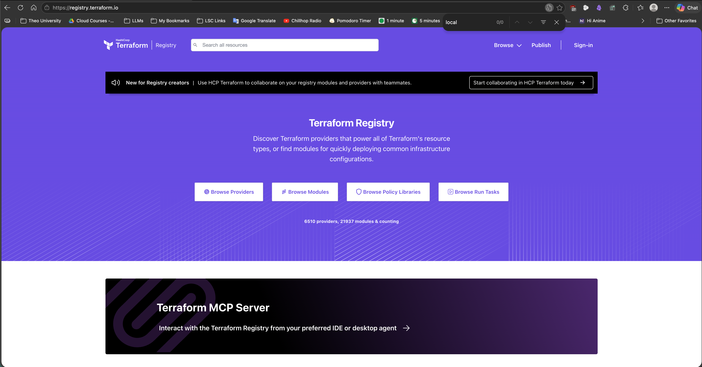

Click "Browse Providers"

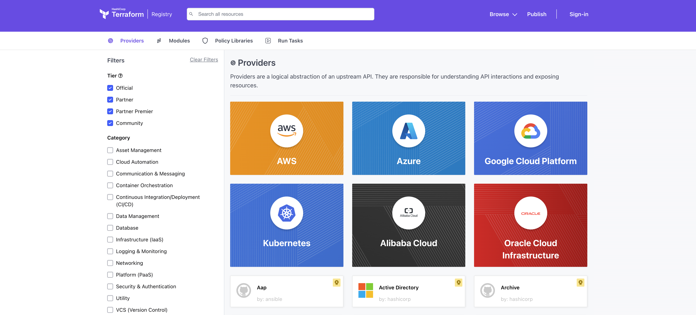

> [!TIP]
>
> On the Proivders page, you can filter providers or search as needed.

### 3.2 Retrieve Documentation for the Most Recent Versions of the Required Providers

#### 3.2.a Google Provider

Open the provider documentation in a new tab:

* Google( Google Cloud Platform, by Hashicorp)
* 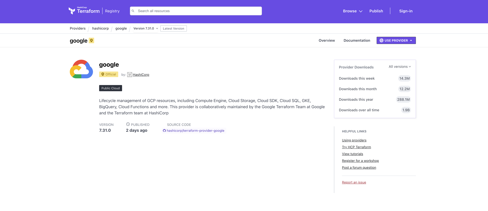

#### 3.2.b Local Provider

Open the provider documentation in a new tab:

* Local (Local, by Hashicorp)
* 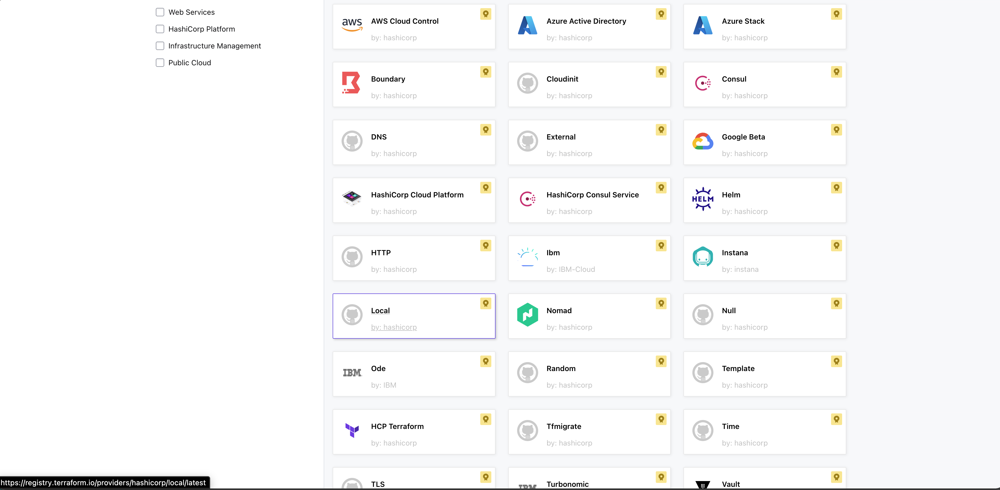

---

## 4. Develop Terraform Code for the Project

Use the Terraform provider documentation and follow the steps below to develop Terraform code for the project

### 4.1 Add Required Providers in `00-authentication.tf`

#### 4.1.a Google Terraform Provider

Open the Google Terraform provider and click the "USE PROVIDER" dropdown.

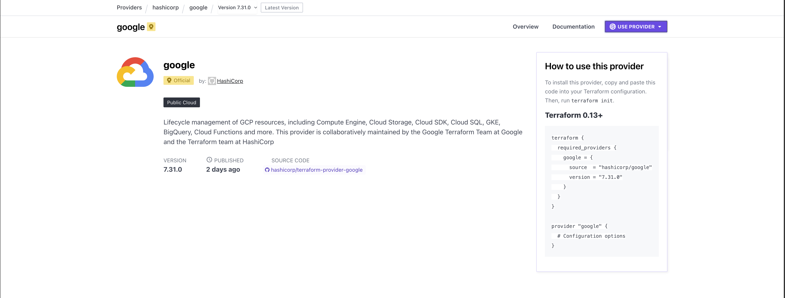

Copy the entire code block and paste it into `00-authentication.tf`

```hcl
terraform {
  required_providers {
    google = {
      source  = "hashicorp/google"
      version = "7.31.0"
    }
  }
}

provider "google" {
  # Configuration options
}
```

Edit the `provider "google"` block by adding `project` and `region` arguments. The values are your project ID and deployment region, respectively.

Example Google provider configuration

```hcl
project = "kirk-devsecops-sandbox"
region = "us-central1"
```

#### 4.1.b Hashicorp Local Provider

Open the Hashicorp Local provider and click the "USE PROVIDER" dropdown.

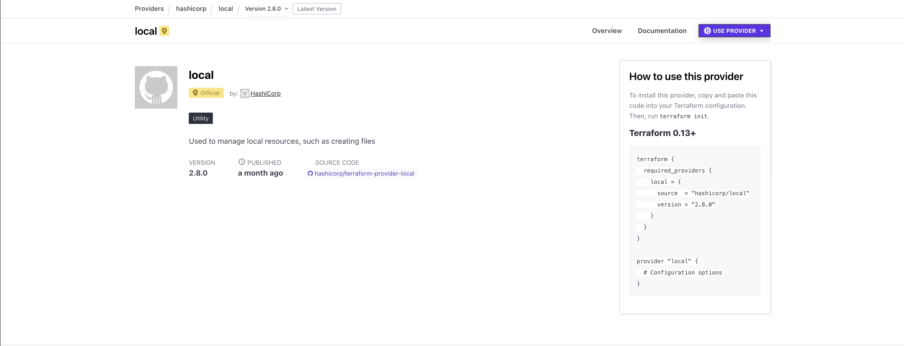

Copy only the `local = {}` argument and add it the `required providers` block

```hcl
    local = {
      source  = "hashicorp/local"
      version = "2.8.0"
    }
```

### 4.2 Review `00-authentication.tf`

Your file configuration should be similar to this:

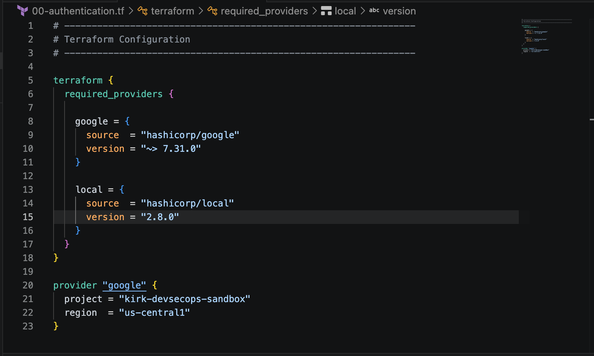

> [!TIP]
>
> Run `terraform validate` to check your configuration. If there are any errors, fix them before proceeding.

## 5. Add the VPC Resource in `01-vpc.tf`

### 5.1 Find `google_compute_network` in the Google Provider Documentation

In the Google Cloud Cloud provider documentation, search for `google_compute_network` and click the `google_compute_network` resource to view documentation for the resource.

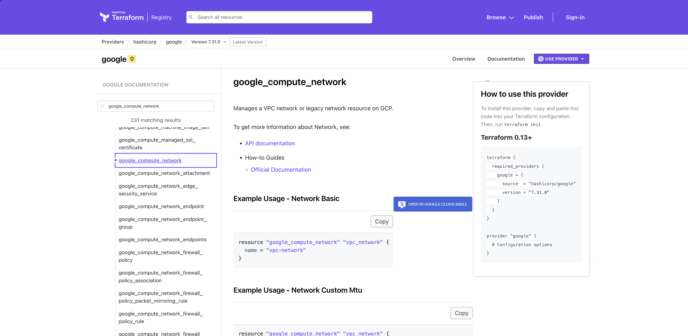

### 5.2 Develop the `google_compute_network` Resource Block

Copy the code block for "Example Usage - Network Basic," paste it into VS code, and save the file.

```hcl
resource "google_compute_network" "vpc_network" {
  name = "vpc-network"
}
```

> [!NOTE]
>
> Modify the resource name (`vpc_network`) and the value of the `name` attribute (`vpc-network`) as you see fit.

> [!TIP]
>
> Be sure to review the [Terraform Style Guide](https://developer.hashicorp.com/terraform/language/style) for information about code formatting, resource naming, referencing resources, and other important conventions.

### 5.3 Review `01-vpc.tf`

Your file configuration should be similar to this:

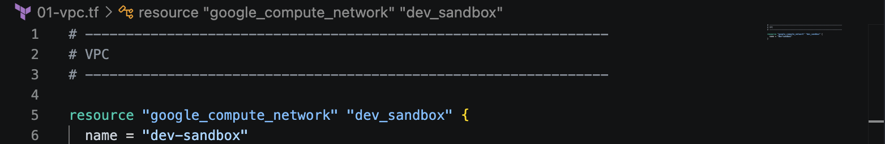

> [!TIP]
>
> Run `terraform validate` to check your configuration. If there are any errors, fix them before proceeding.

## 6. Add the `favorite_food` Resource in `02-local-files.tf`

### 6.1 Find `local_file` in the Hashicorp Local Provider Documentation

In the Hashicorp Local provider documentation, search for `local_file` and click the `local_file` resource to view documentation for the resource.

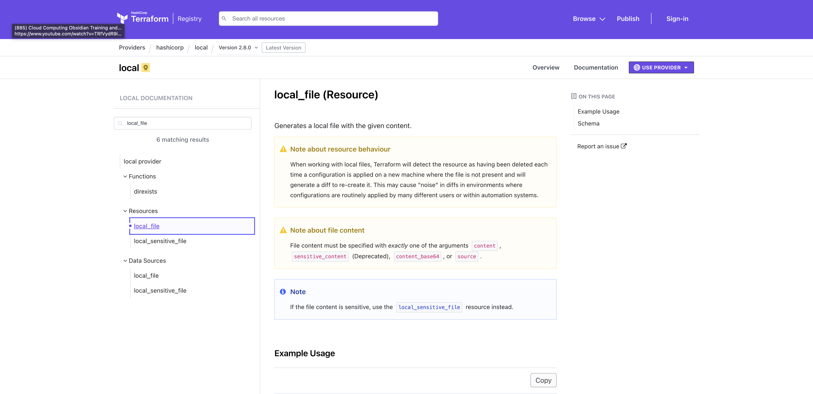

### 6.2 Develop the `local_file` Resource Block

Copy the code block for "Example Usage" and paste it into VS code.

```hcl
resource "local_file" "foo" {
  content = "foo!"
  filename = "${path.module}/foo.bar"
}
```

Make the following modifications to the resource block:

* Change the resource name from `"foo"` to `"favorite_food"`.
* Change the value of `content` to your favorite food. For example, `"lamb rib chops"`
* Change the value of `filename` to `${path.module}/rendered/favorite-food.txt"`. This saves the contents of the `local_file` resource to a file called `favorite-food.txt`

### 6.3 Review `02-local-files.tf`

Your file configuration should be similar to this:

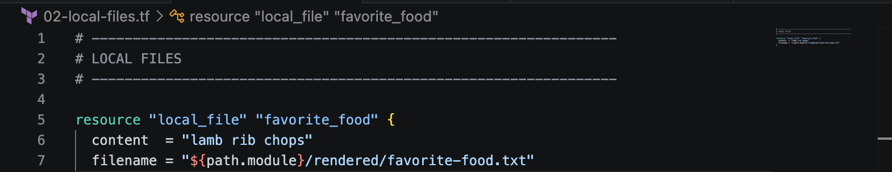

> [!TIP]
>
> Run `terraform validate` to check your configuration. If there are any errors, fix them before proceeding.

## 7. Add Desired Output(s) in `03-output.tf`

### 7.1 Review the Output Block Documentation

> [!NOTE]
>
> An `output` block reference allows Terraform to expose information about your infrastructure. The `output` block values appear in the UI after Terraform applies your configuration.

Review the [Terraform output block reference documentation](https://developer.hashicorp.com/terraform/language/block/output) for information about how to use `output` blocks in Terraform.


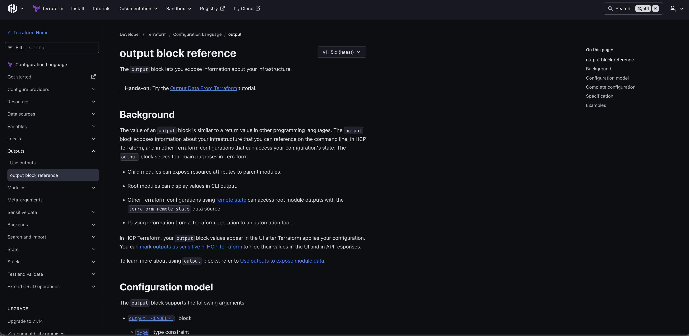

### 7.2 Develop the `output` Resource Block

Copy the "Basic Example" `output` code block from the documentation, and paste it into VS code.

```hcl
output "instance_ip_addr" {
  value = aws_instance.server.private_ip
  description = "The private IP address of the main server instance."
}
```

Make the following modifications to the output block:

* Change the output name from `"instance_ip_addr"` to `"vpc_name"`.
* Set the value of `value` to reference the name of your VPC resource (ex. `google_compute_network.dev_sandbox.name`).
* Remember
* Set the value of `description` to `"Name of the VPC"`

### 7.3 Review `03-outputs.tf`

Your file configuration should be similar to this:

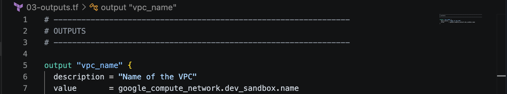

> [!TIP]
>
> Run `terraform validate` to check your configuration. If there are any errors, fix them before proceeding.

---

## 8. Standardize Format for All Terraform Files (Optional)

Run `terraform fmt -recursive` to properly format all files in the project.

> [!NOTE]
>
> `terraform fmt` formats Terraform files in Hashicorp Configuration Language (HCL) format, Hashicorps standardized format and style. If the return is empty, your files are already properly formatted.

Example Results

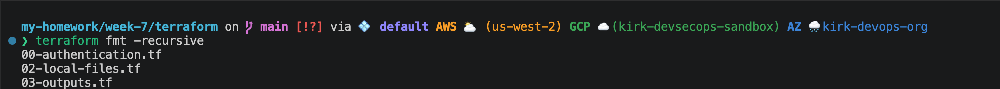

---

## 9. Run the Terraform Deployment Process

### 9.1 Terraform Validate

Run `terraform validate` to check your configuration. If there are any errors, fix them before proceeding.

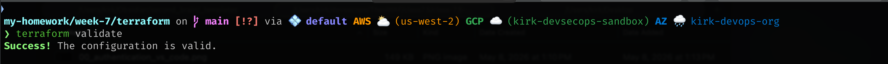

### 9.2 Terraform Plan

Run `terraform plan` to generate a plan. If Terraform reports any errors, fix them before proceeding.

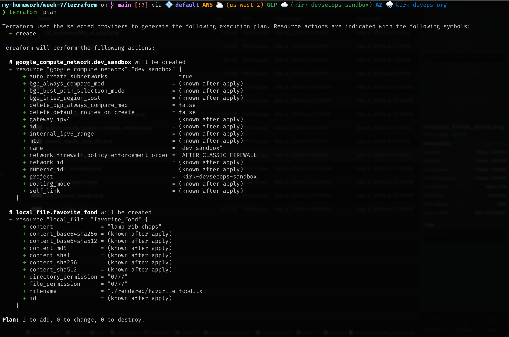

### 9.3 Terraform Apply

Run `terraform apply` to excecute the deployment process. When prompted, type `yes` to confirm deployment. If Terraform reports any errors, fix them before proceeding.

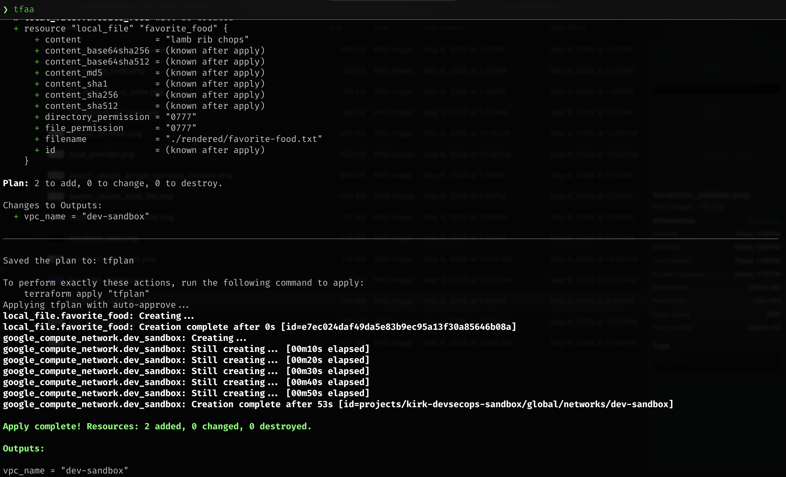

## 10. Confirm Successful Deployment

### 10.1 Confirm Success Message and Outputs

If successful, Terraform should return a deployment success message with outputs.

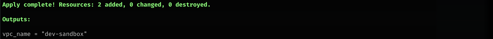

### 10.2 Confirm Creation of the VPC Resource in the GCP Console

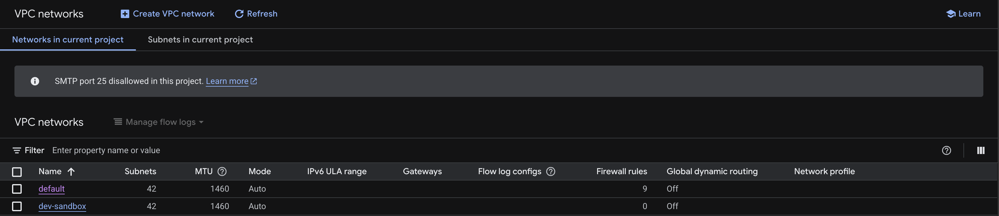

### 10.3 Confirm Creation of the `rendered` Directory

Run the following command to confirm that the `rendered` directory was created:

```bash
ls
```

Confirm the `rendered` directory was created.

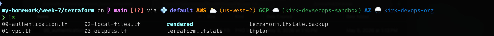

If the directory doesn't exist, double check your current path and review the `filename` argument for the `"local_file.favorite_food"` resource in `02-local-files.tf`. Fix any issues before proceeding.

### 10.4 Confirm Creation of the `favorite-food.txt` File

Run this command to naviagate to the `rendered` directory and confirm that a file named `favorite-food.txt` was created:

```bash
cd rendered & ls
```


If the file doesn't exist, double check your current path and review the `filename` argument for the `"local_file.favorite_food"` resource in `02-local-files.tf`.

### 10.5 Confirm Contents of the `favorite-food.txt` File

Run the following command to verify the contents of the `favorite-food.txt` file.

Show contents of the `favorite-food.txt` file.

```bash
cat rendered/favorite-food.txt
```

### 10.6 Compare the Contents of `favorite-food.text` with `02-local-files.tf`

Compare the results of the `cat` command to the value of the `content` argument in the `local_file.favorite_food` resource in `02-local-files.tf`.

If successful, the contents of `favorite-food.txt` will match the value of `content`

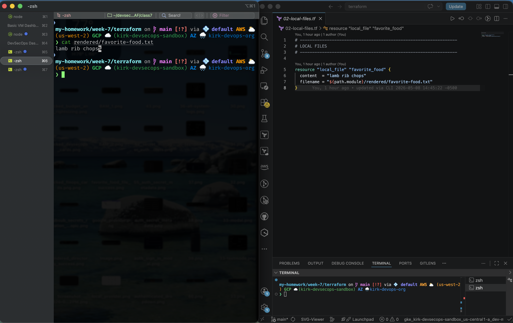

---

## 11. Lab Cleanup

### 11.1 Destroy the Deployment

Run `terraform destroy` to remove all resources created by this lab. When prompted, type `yes` to confirm destruction.

If successful, Terraform should return a destruction success message.

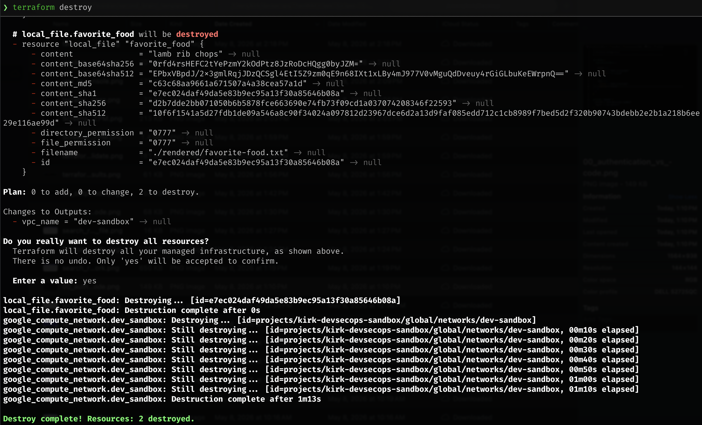

---

## Resources Used

* [Terraform Registry](https://registry.terraform.io/)
* [Terraform Google Provider](https://registry.terraform.io/providers/hashicorp/google/latest)
* [Terraform Local Provider](https://registry.terraform.io/providers/hashicorp/local/latest)
* [Terraform - Google Documentation: google_compute_network](https://registry.terraform.io/providers/hashicorp/google/latest/docs/resources/compute_network)
* [Terraform - Local Documentation: local_file (Resource)](https://registry.terraform.io/providers/hashicorp/local/latest/docs/resources/file)
* [Terraform - Output Block Reference](https://developer.hashicorp.com/terraform/language/block/output)
* [Terraform Style Guide](https://developer.hashicorp.com/terraform/language/style)
* [Terraform fmt Command](https://developer.hashicorp.com/terraform/cli/commands/fmt)