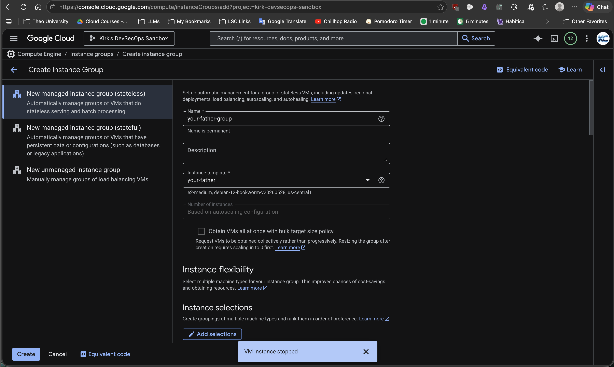
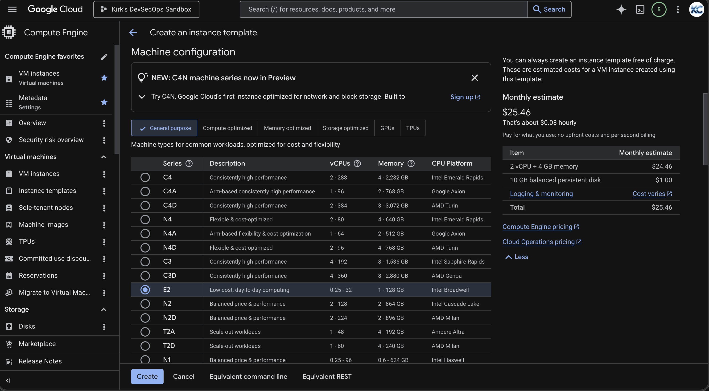
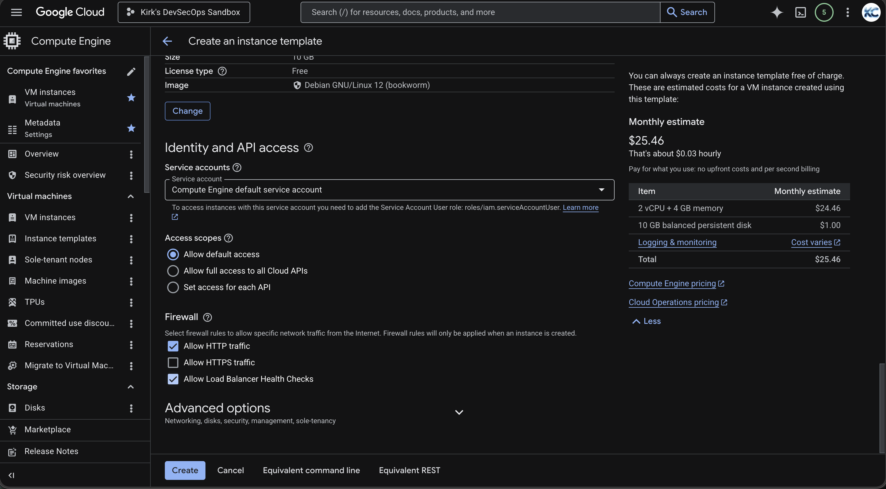
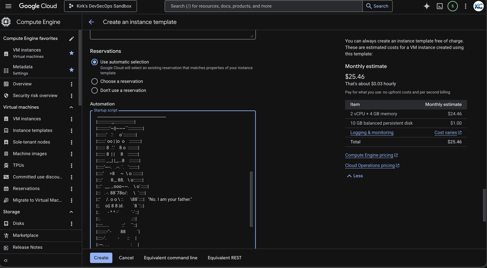
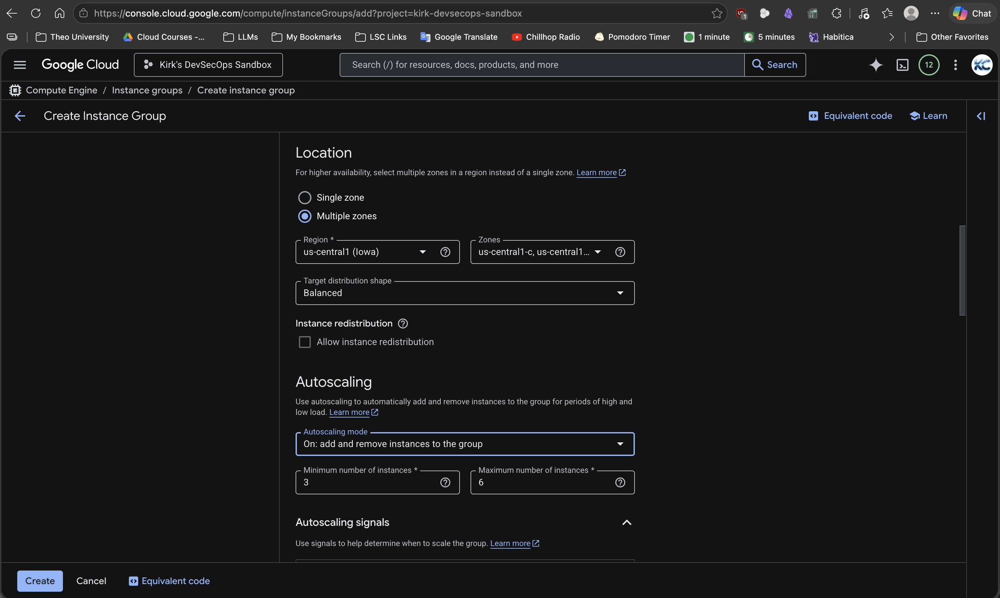
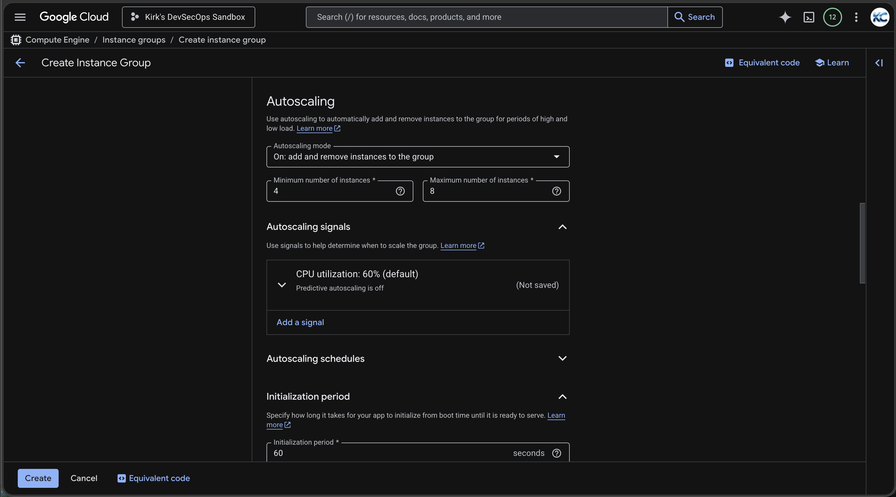
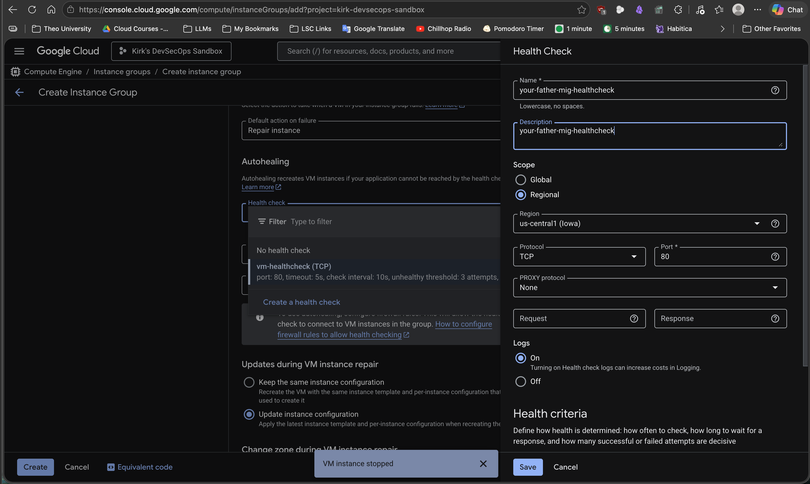
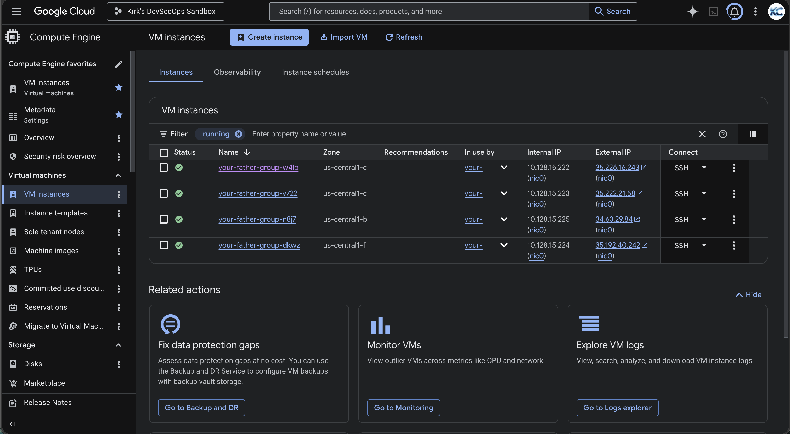
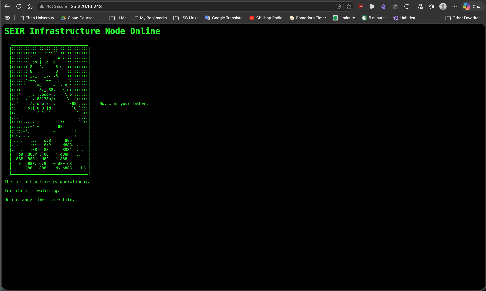

# ClickOps Runbook: Managed Instance Group

Use this runbook to create a regional managed instance group from a VM startup script. The end state is an autoscaled, autohealed instance group running the selected web startup script on port `80`. All steps are performed in the GCP Console.

## Prerequisites

- GCP project selected in the Console.
- Compute Engine API enabled.
- Permissions to create instance templates, managed instance groups, firewall rules, and health checks.
- Region: `us-central1 (Iowa)`.
- A startup script

## Step 1: Create the Instance Template

1. Go to **Compute Engine > Instance templates**.
2. Select **Create instance template**.
3. Configure the template:

| Setting | Value |
| --- | --- |
| Name | `<script-name>-template` |
| Location | Regional, `us-central1` |
| Machine family | General purpose |
| Series | E2 |
| Machine type | Any valid E2 (`e2-medium`, `e2-micro`, `e2-small`) |
| Boot disk | Debian or Ubuntu |

4. Open **Advanced options**.
5. In **Networking**, enable:
   - **Allow HTTP traffic**
   - **Allow load balancer health checks**

6. In **Management > Automation**, paste the content of your startup script into **Startup script**.

7. Select **Create**.

## Step 2: Create the Managed Instance Group

1. Go to **Compute Engine > Instance groups**.
2. Select **Create instance group**.
3. Select **New managed instance group**.
4. Configure the group:

| Setting | Value |
| --- | --- |
| Name | `<name>-mig` |
| Instance template | Select your instance template |
| Location | Multiple zones |
| Region | `us-central1` |
| Target distribution shape | Balanced |

5. In **Autoscaling**, select **On: add and remove instances to the group**.
6. Configure autoscaling:

| Setting | Value |
| --- | --- |
| Minimum number of instances | `4` |
| Maximum number of instances | `8` |
| Autoscaling signal | CPU utilization, default target is acceptable unless your lab specifies another value |

7. Leave **Repair instances** enabled.

## Step 4: Configure Autohealing

1. In the managed instance group form, go to **Autohealing**.
2. Select **Create a health check**.
3. Configure the health check:

| Setting | Value |
| --- | --- |
| Name | `<name>-healthcheck` |
| Description | `TCP health check on port 80` |
| Scope | Regional |
| Protocol | TCP |
| Port | `80` |
| Logs | On |
| Check interval | `5` seconds |
| Timeout | `5` seconds |
| Healthy threshold | `2` |
| Unhealthy threshold | `2` |

4. If the Console asks for an initial delay, use `120` seconds.
5. Save the health check.
6. Finish creating the managed instance group.

## Step 5: Validate the Deployment

1. Open **Compute Engine > Instance groups**.
2. Select your instance group.
3. Confirm the group created at least `4` instances.
4. Confirm instances are distributed across multiple `us-central1` zones.
5. Wait for the health check state to become healthy.
6. Copy the external IP of an instance and open it in a browser:
8. Confirm the frontend loads.

